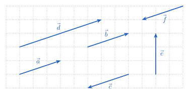
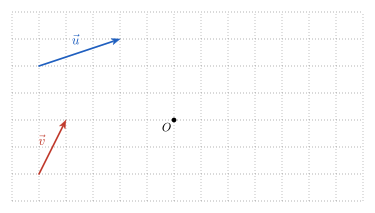
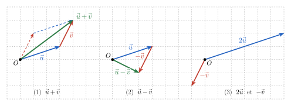
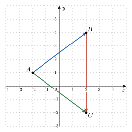
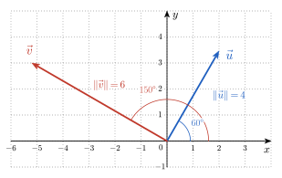
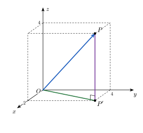
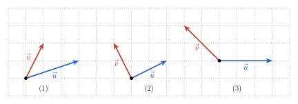
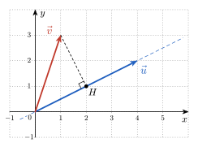
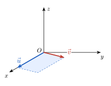
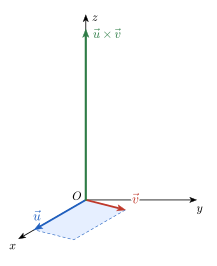

<!-- SOCLE = LE NOYAU (à faire par tous, en séance ou à la maison).
     Vecteurs et systèmes de coordonnées. Une FIGURE dès que possible (img/*.svg, générées par
     img/figs.py : texte vectorisé, rendu identique en PDF typst et sur le site).
     HIÉRARCHIE DES INDICES (à respecter partout) :
       Indice 1 = renvoi à la théorie du cours (titres à aligner sur les slides IMSV-4) ;
       Indice 2 = une QUESTION à se poser (surtout pas la réponse) ;
       Indice 3 = une ÉTAPE (un pas concret, sans donner la solution).
     Numéro AUTOMATIQUE (pas écrit). Faisable SANS calculatrice.
     Notations : \vec u, \overrightarrow{AB}, \left\Vert \vec u \right\Vert, \vec u\cdot\vec v, \vec u\times\vec v,
     coordonnées en ligne \vec v = (v_x, v_y) dans R^2, (v_1, …, v_n) dans R^n (comme au cours).
     Indice 1 : titres des slides IMSV-4 (M. Randour). -->

::: {.callout-caution .exo title="Exercice|Socle|1|O1"}
On considère les six flèches ci-dessous.

{fig-alt="Six flèches a à f sur un quadrillage" width="10.6cm" fig-align="center"}

(a) Quelles flèches représentent le **même vecteur** que $\vec a$ ?
(b) Quelles flèches ont la **même direction** que $\vec a$ ?
(c) Parmi celles-ci, lesquelles ont le **sens opposé** à celui de $\vec a$ ?
(d) Quelles flèches ont la **même norme** que $\vec a$ ?
(e) Quelle flèche représente le vecteur $2\vec a$ ? Et le vecteur $-\vec a$ ?
:::

::: {.aides}
::: {.panel-tabset}

## Indice 1

Retourne à la théorie du cours : *Grandeurs scalaires et vectorielles*, *Point ou vecteur ?* et
*Coordonnées et direction*.

## Indice 2

*Question à te poser.*

Deux flèches dessinées à des endroits différents peuvent-elles représenter le même vecteur ?

## Indice 3

*Étape.*

Pour chaque flèche, compte le déplacement sur le quadrillage : combien de carreaux vers la droite
(ou la gauche), combien vers le haut (ou le bas) ? Compare ensuite ces déplacements à celui de
$\vec a$ (3 carreaux vers la droite, 1 vers le haut).

## Solution

On lit les déplacements : $\vec a$, $\vec b$ : 3 à droite, 1 en haut ; $\vec c$, $\vec f$ : 3 à gauche,
1 en bas ; $\vec d$ : 6 à droite, 2 en haut ; $\vec e$ : 3 en haut.

(a) $\vec b$ seulement : même direction, même sens et même norme. Elle est dessinée ailleurs, mais une
flèche n'est qu'un **représentant** du vecteur.
(b) $\vec b$, $\vec c$, $\vec d$ et $\vec f$ : elles sont toutes parallèles à $\vec a$. Seule $\vec e$ a une
autre direction.
(c) $\vec c$ et $\vec f$.
(d) $\vec b$, $\vec c$ et $\vec f$. Changer le sens ne change pas la norme.
(e) $\vec d = 2\vec a$ (même direction, même sens, norme double) ; $\vec c$ et $\vec f$ représentent tous
deux $-\vec a$.

## Piège

Confondre **direction** (la droite qui porte la flèche) et **sens** (le côté vers lequel elle
pointe) : $\vec c$ a la même direction que $\vec a$, mais pas le même sens.

:::
:::

::: {.callout-caution .exo title="Exercice|Socle|2|O2"}
Sur la grille ci-dessous, en partant chaque fois du point $O$ :

{fig-alt="Deux vecteurs u et v et un point O sur un quadrillage" width="10.6cm" fig-align="center"}

(a) construire $\vec u + \vec v$ et $\vec u - \vec v$ ;
(b) construire $2\vec u$ et $-\vec v$ ;
(c) lire les coordonnées de $\vec u$, de $\vec v$ et des quatre vecteurs construits. Vérifier par un
calcul sur les coordonnées.
:::

::: {.aides}
::: {.panel-tabset}

## Indice 1

Retourne à la théorie du cours : *Addition* et *Produit par un scalaire*.

## Indice 2

*Question à te poser.*

Pour additionner deux vecteurs, où places-tu l'origine du second ? Et soustraire $\vec v$, c'est ajouter
quel vecteur ?

## Indice 3

*Étape.*

Dessine $\vec u$ à partir de $O$, puis $\vec v$ **bout à bout** (son origine à l'extrémité de $\vec u$) :
$\vec u + \vec v$ va de $O$ à la dernière extrémité. Pour $\vec u - \vec v$, fais de même avec
$-\vec v$.

## Solution

{fig-alt="Constructions de u+v, u-v, 2u et -v" width="12.4cm" fig-align="center"}

(1) $\vec u + \vec v$ : on met les flèches bout à bout. Le parallélogramme (en pointillés) montre qu'on
obtient le même vecteur en commençant par $\vec v$ : $\vec u + \vec v = \vec v + \vec u$.
(2) $\vec u - \vec v = \vec u + (-\vec v)$.
(3) $2\vec u$ : même direction et même sens que $\vec u$, norme double ; $-\vec v$ : même direction et
même norme que $\vec v$, sens opposé.

En coordonnées : $\vec u = (3, 1)$ et $\vec v = (1, 2)$, donc
$\vec u + \vec v = (4, 3)$, $\vec u - \vec v = (2, -1)$, $2\vec u = (6, 2)$ et $-\vec v = (-1, -2)$ :
on opère **coordonnée par coordonnée**, ce qui correspond exactement aux constructions.

## Piège

Dessiner les deux flèches à partir de la **même** origine et prendre la flèche qui relie leurs
extrémités : c'est $\vec u - \vec v$ (ou $\vec v - \vec u$), pas $\vec u + \vec v$.

:::
:::

::: {.callout-caution .exo title="Exercice|Socle|2|O3"}
Dans le repère ci-dessous :

{fig-alt="Triangle ABC dans un repère" width="7.5cm" fig-align="center"}

(a) Lire les coordonnées des points $A$, $B$ et $C$.
(b) Calculer les coordonnées des vecteurs $\overrightarrow{AB}$, $\overrightarrow{BC}$ et $\overrightarrow{AC}$.
(c) Vérifier que $\overrightarrow{AB} + \overrightarrow{BC} = \overrightarrow{AC}$.
(d) Le point $B$ et le vecteur $\overrightarrow{AB}$ ont-ils les mêmes coordonnées ? Pourquoi ?
(e) Calculer $\left\Vert \overrightarrow{AB} \right\Vert$ et $\left\Vert \overrightarrow{AC} \right\Vert$. Que peut-on dire du triangle $ABC$ ?
:::

::: {.aides}
::: {.panel-tabset}

## Indice 1

Retourne à la théorie du cours : *Point ou vecteur ?*, *Coordonnées cartésiennes* et *Norme d'un vecteur*.

## Indice 2

*Question à te poser.*

Comment lit-on, à partir des coordonnées de $A$ et de $B$, le déplacement qui mène de $A$ à $B$ ?

## Indice 3

*Étape.*

Les coordonnées de $\overrightarrow{AB}$ s'obtiennent en faisant « extrémité moins origine » :
$\overrightarrow{AB} = (x_B - x_A,\ y_B - y_A)$. Pour la norme, pense à Pythagore.

## Solution

(a) $A = (-2, 1)$, $B = (2, 4)$, $C = (2, -2)$.
(b) $\overrightarrow{AB} = (2 - (-2),\ 4 - 1) = (4, 3)$ ; $\overrightarrow{BC} = (0, -6)$ ;
$\overrightarrow{AC} = (4, -3)$.
(c) $(4, 3) + (0, -6) = (4, -3)$. ✓ Aller de $A$ à $B$ puis de $B$ à $C$ revient à aller de $A$ à $C$.
(d) **Non** : $B = (2, 4)$ repère une **position**, $\overrightarrow{AB} = (4, 3)$ décrit un
**déplacement**. Les deux coïncident seulement quand l'origine du vecteur est l'origine du repère.
(e) $\left\Vert \overrightarrow{AB} \right\Vert = \sqrt{4^2 + 3^2} = \sqrt{25} = 5$ et
$\left\Vert \overrightarrow{AC} \right\Vert = \sqrt{4^2 + (-3)^2} = 5$ : le triangle $ABC$ est **isocèle** en $A$.

## Piège

Calculer « origine moins extrémité » : on obtient $\overrightarrow{BA} = -\overrightarrow{AB}$, le
vecteur de sens opposé.

:::
:::

::: {.callout-caution .exo title="Exercice|Socle|2|O3"}
Les vecteurs $\vec u$ et $\vec v$ sont donnés par leur norme et l'angle qu'ils font avec l'axe des $x$.

{fig-alt="Vecteur u de norme 4 à 60 degrés et vecteur v de norme 6 à 150 degrés" width="8.7cm" fig-align="center"}

(a) Calculer les coordonnées de $\vec u$.
(b) Calculer les coordonnées de $\vec v$.
(c) Inversement, on donne $\vec w = (-2, 2)$. Calculer sa norme et l'angle qu'il fait avec l'axe des $x$.
:::

::: {.aides}
::: {.panel-tabset}

## Indice 1

Retourne à la théorie du cours : *De la norme aux coordonnées* et *Coordonnées et direction*.

## Indice 2

*Question à te poser.*

Sur le cercle trigonométrique, quelles sont les coordonnées du point d'angle $\theta$ ? Que deviennent-elles
si le rayon vaut $4$ au lieu de $1$ ?

## Indice 3

*Étape.*

Un vecteur de norme $r$ qui fait l'angle $\theta$ avec l'axe des $x$ s'écrit
$r\,(\cos\theta,\ \sin\theta)$. Pour (c), place $\vec w$ sur un croquis pour repérer son quadrant.

## Solution

(a) $\vec u = 4\,(\cos 60°,\ \sin 60°) = 4\left(\dfrac12,\ \dfrac{\sqrt3}{2}\right) = \left(2,\ 2\sqrt3\right)$.
(b) $\vec v = 6\,(\cos 150°,\ \sin 150°) = 6\left(-\dfrac{\sqrt3}{2},\ \dfrac12\right) = \left(-3\sqrt3,\ 3\right)$.
Le cosinus est négatif : $\vec v$ pointe vers la gauche, comme sur la figure.
(c) $\left\Vert \vec w \right\Vert = \sqrt{(-2)^2 + 2^2} = \sqrt8 = 2\sqrt2$. Alors
$\cos\theta = \dfrac{-2}{2\sqrt2} = -\dfrac{\sqrt2}{2}$ et $\sin\theta = \dfrac{2}{2\sqrt2} = \dfrac{\sqrt2}{2}$ :
$\theta = 135°$ (deuxième quadrant).

## Piège

Oublier le **signe** imposé par le quadrant : $\cos 150° < 0$. En (c), trouver $\theta = 45°$ en ne
regardant que $\left|\tfrac{y}{x}\right| = 1$, sans voir que $\vec w$ pointe vers la gauche.

:::
:::

::: {.callout-caution .exo title="Exercice|Socle|2|O2"}
Soient $\vec u = (2, -1)$ et $\vec v = (-3, 4)$.

(a) Calculer $\vec u + \vec v$ et $3\vec u - 2\vec v$.
(b) Calculer $\left\Vert \vec v \right\Vert$, puis donner le vecteur unitaire (de norme $1$) qui a la même direction et le même
sens que $\vec v$.
(c) Les vecteurs $(2, -6)$ et $(-1, 3)$ sont-ils colinéaires ? Et les vecteurs $(4, 6)$ et $(6, 8)$ ?
:::

::: {.aides}
::: {.panel-tabset}

## Indice 1

Retourne à la théorie du cours : *Norme d'un vecteur*, *Produit par un scalaire* et *Colinéarité*.

## Indice 2

*Question à te poser.*

Multiplier un vecteur par un nombre positif change-t-il sa direction ? son sens ? sa norme ? Et deux
vecteurs colinéaires, par quoi sont-ils reliés ?

## Indice 3

*Étape.*

En (b), divise $\vec v$ par sa norme. En (c), cherche un réel $\lambda$ tel que le premier vecteur soit $\lambda$
fois le second, **pour les deux coordonnées à la fois**.

## Solution

(a) $\vec u + \vec v = (2 - 3,\ -1 + 4) = (-1, 3)$ ;
$3\vec u - 2\vec v = (6, -3) - (-6, 8) = (12, -11)$.
(b) $\left\Vert \vec v \right\Vert = \sqrt{9 + 16} = 5$. Le vecteur cherché est $\dfrac15\,\vec v = \left(-\dfrac35,\ \dfrac45\right)$ :
multiplier par $\frac15 > 0$ garde la direction et le sens, et ramène la norme à $1$.
(c) $(2, -6) = -2\,(-1, 3)$ : **colinéaires** (même direction, sens opposés).
Pour $(4, 6)$ et $(6, 8)$ : il faudrait $\lambda = \dfrac46 = \dfrac23$ pour la première coordonnée et
$\lambda = \dfrac68 = \dfrac34$ pour la seconde. Pas de $\lambda$ commun : **non colinéaires**.

## Piège

En (a), oublier que $-2\vec v$ change le signe des **deux** coordonnées. En (c), conclure sur une seule
coordonnée.

:::
:::

::: {.callout-caution .exo title="Exercice|Socle|2|O3"}
Dans l'espace, on considère le point $P = (2, 4, 4)$ et son projeté $P' = (2, 4, 0)$ sur le plan $(x, y)$.

{fig-alt="Point P dans un repère de l'espace, avec son projeté P' et la boîte de côtés 2, 4 et 4" width="7.9cm" fig-align="center"}

(a) Calculer $\left\Vert \overrightarrow{OP'} \right\Vert^2$ à l'aide de Pythagore dans le plan $(x, y)$.
(b) Le triangle $OP'P$ est rectangle en $P'$. En déduire $\left\Vert \overrightarrow{OP} \right\Vert$.
(c) En suivant le même raisonnement, écrire une formule pour la norme d'un vecteur $(x, y, z)$.
(d) Par analogie, calculer la norme du vecteur $(2, 1, 2, 4)$ de $\mathbb{R}^4$.
:::

::: {.aides}
::: {.panel-tabset}

## Indice 1

Retourne à la théorie du cours : *Passage à $\mathbb{R}^3$ et $\mathbb{R}^n$*.

## Indice 2

*Question à te poser.*

Quels sont les côtés de l'angle droit dans chacun des deux triangles rectangles : d'abord dans le plan
$(x, y)$, puis dans le triangle vertical $OP'P$ ?

## Indice 3

*Étape.*

Dans le plan, les côtés de l'angle droit mesurent $2$ et $4$. Dans le triangle $OP'P$, ce sont $\left\Vert \overrightarrow{OP'} \right\Vert$
et $\left\Vert \overrightarrow{P'P} \right\Vert = 4$.

## Solution

(a) $\left\Vert \overrightarrow{OP'} \right\Vert^2 = 2^2 + 4^2 = 20$.
(b) $\left\Vert \overrightarrow{OP} \right\Vert^2 = \left\Vert \overrightarrow{OP'} \right\Vert^2 + \left\Vert \overrightarrow{P'P} \right\Vert^2 = 20 + 16 = 36$, donc $\left\Vert \overrightarrow{OP} \right\Vert = 6$.
(c) On applique deux fois Pythagore : $\left\Vert (x, y, z) \right\Vert^2 = (x^2 + y^2) + z^2$, soit
$\left\Vert (x, y, z) \right\Vert = \sqrt{x^2 + y^2 + z^2}$.
(d) On ajoute un carré par coordonnée : $\sqrt{4 + 1 + 4 + 16} = \sqrt{25} = 5$. On ne peut plus
dessiner $\mathbb{R}^4$, mais le calcul se prolonge sans difficulté.

## Piège

Additionner les coordonnées au lieu de leurs **carrés**, ou oublier la racine carrée à la fin.

:::
:::

::: {.callout-caution .exo title="Exercice|Socle|2|O4"}
Pour chacune des trois paires de vecteurs (1), (2) et (3) ci-dessous :

{fig-alt="Trois paires de vecteurs u et v sur un quadrillage" width="12.2cm" fig-align="center"}

(a) sans calcul, dire si $\vec u \cdot \vec v$ est positif, négatif ou nul ;
(b) lire les coordonnées de $\vec u$ et de $\vec v$, puis vérifier en calculant $\vec u \cdot \vec v$.
:::

::: {.aides}
::: {.panel-tabset}

## Indice 1

Retourne à la théorie du cours : *Produit scalaire : pourquoi ?* et *Produit scalaire en coordonnées*.

## Indice 2

*Question à te poser.*

Dans $\vec u \cdot \vec v = \left\Vert \vec u \right\Vert\,\left\Vert \vec v \right\Vert\cos\theta$, quels facteurs
peuvent être négatifs ?

## Indice 3

*Étape.*

Regarde si l'angle entre les deux flèches est aigu, droit ou obtus. Pour le calcul,
$\vec u \cdot \vec v = u_x v_x + u_y v_y$.

## Solution

Le signe de $\vec u \cdot \vec v$ est celui de $\cos\theta$.

(1) Angle aigu : **positif**. $\vec u = (3, 1)$, $\vec v = (1, 2)$ : $3 + 2 = 5 > 0$.
(2) Angle droit : **nul**. $\vec u = (2, 1)$, $\vec v = (-1, 2)$ : $-2 + 2 = 0$.
(3) Angle obtus : **négatif**. $\vec u = (3, 0)$, $\vec v = (-2, 2)$ : $-6 + 0 = -6 < 0$.

## Piège

Croire qu'un produit scalaire nul signifie qu'un des vecteurs est nul : il suffit que les vecteurs
soient **orthogonaux**.

:::
:::

::: {.callout-caution .exo title="Exercice|Socle|1|O4"}
(a) Les vecteurs $\vec u$ et $\vec v$ sont non nuls et $\vec u \cdot \vec v > 0$. Que peut-on conclure ?

::: {.content-visible when-format="html"}
::: {.columns}
::: {.column width="50%"}
(A) Ils ont la même direction et le même sens.
(B) Ils sont orthogonaux.
(C) L'angle entre eux est aigu.
:::
::: {.column width="50%"}
(D) Ils sont nécessairement colinéaires.
(E) $\left\Vert \vec u \right\Vert > \left\Vert \vec v \right\Vert$.
:::
:::
:::

```{=typst}
#grid(columns: (1fr, 1fr), row-gutter: 0.65em,
  [(A) Ils ont la même direction et le même sens.], [(D) Ils sont nécessairement colinéaires.],
  [(B) Ils sont orthogonaux.], [(E) $norm(arrow(u)) > norm(arrow(v))$.],
  [(C) L'angle entre eux est aigu.], [])
```

(b) Même question si $\vec u \cdot \vec v < 0$ : que peut-on dire de l'angle entre $\vec u$ et $\vec v$ ?
:::

::: {.aides}
::: {.panel-tabset}

## Indice 1

Retourne à la théorie du cours : *Produit scalaire : pourquoi ?* et *Produit scalaire via les angles*.

## Indice 2

*Question à te poser.*

Dans $\vec u \cdot \vec v = \left\Vert \vec u \right\Vert\,\left\Vert \vec v \right\Vert\cos\theta$, avec
$\theta \in [0, \pi]$, quel facteur peut changer de signe ?

## Indice 3

*Étape.*

Repère sur le cercle trigonométrique les angles de $[0, \pi]$ dont le cosinus est positif, nul, puis
négatif.

## Solution

(a) **(C)**. Les normes sont positives : $\vec u \cdot \vec v$ a le signe de $\cos\theta$, qui est positif
pour $\theta \in [0, \tfrac{\pi}{2}[$. (A) n'est qu'un cas particulier ($\theta = 0$) ; (B) donnerait
$\vec u \cdot \vec v = 0$ ; (D) est faux, $(3, 1) \cdot (1, 2) = 5 > 0$ alors que ces vecteurs ne sont pas
colinéaires ; (E) ne dit rien sur l'angle.
(b) $\cos\theta < 0$ pour $\theta \in \,]\tfrac{\pi}{2}, \pi]$ : l'angle est **obtus ou plat**.

## Piège

Confondre « même sens » et « angle aigu » : un produit scalaire positif dit seulement que les deux
vecteurs vont « plutôt » dans le même sens.

:::
:::

::: {.callout-caution .exo title="Exercice|Socle|2|O4"}
(a) Calculer l'angle entre $\vec u = (3, 0)$ et $\vec v = (2, 2)$.
(b) Calculer l'angle entre $\vec u = (1, \sqrt3)$ et $\vec v = (\sqrt3, 1)$.
(c) Trouver le réel $a$ pour lequel les vecteurs $(a, 2)$ et $(3, -6)$ sont orthogonaux.
:::

::: {.aides}
::: {.panel-tabset}

## Indice 1

Retourne à la théorie du cours : *Angles via le produit scalaire* et *Orthogonalité*.

## Indice 2

*Question à te poser.*

Le produit scalaire s'écrit de deux façons, avec les coordonnées et avec l'angle : que donne l'égalité
des deux ?

## Indice 3

*Étape.*

Isole le cosinus : $\cos\theta = \dfrac{\vec u \cdot \vec v}{\left\Vert \vec u \right\Vert\,\left\Vert \vec v \right\Vert}$, puis
reconnais une valeur remarquable. En (c), écris que le produit scalaire est nul.

## Solution

(a) $\vec u \cdot \vec v = 6$, $\left\Vert \vec u \right\Vert = 3$, $\left\Vert \vec v \right\Vert = 2\sqrt2$, donc
$\cos\theta = \dfrac{6}{6\sqrt2} = \dfrac{\sqrt2}{2}$ et $\theta = 45°$.
(b) $\vec u \cdot \vec v = \sqrt3 + \sqrt3 = 2\sqrt3$, $\left\Vert \vec u \right\Vert = \left\Vert \vec v \right\Vert = \sqrt{1 + 3} = 2$,
donc $\cos\theta = \dfrac{2\sqrt3}{4} = \dfrac{\sqrt3}{2}$ et $\theta = 30°$. Contrôle : $\vec u$ fait
$60°$ avec l'axe des $x$, $\vec v$ en fait $30°$.
(c) $(a, 2) \cdot (3, -6) = 3a - 12 = 0$, donc $a = 4$.

## Piège

Oublier de diviser par le **produit des normes** : $\cos\theta = 6$ est impossible, un cosinus reste
entre $-1$ et $1$.

:::
:::

::: {.callout-caution .exo title="Exercice|Socle|3|O4"}
On considère $\vec u = (4, 2)$ et $\vec v = (1, 3)$. Le point $H$ est le projeté orthogonal de
l'extrémité de $\vec v$ sur la droite qui porte $\vec u$.

{fig-alt="Projection orthogonale de v sur la droite portant u, au point H" width="6.9cm" fig-align="center"}

(a) Lire les coordonnées de $H$, puis vérifier par un produit scalaire que l'angle en $H$ est droit.
(b) Calculer $\vec u \cdot \vec v$.
(c) Calculer $\left\Vert \vec u \right\Vert$ et $\left\Vert \overrightarrow{OH} \right\Vert$, puis comparer $\left\Vert \vec u \right\Vert \cdot \left\Vert \overrightarrow{OH} \right\Vert$ à $\vec u \cdot \vec v$.
Qu'est-ce que cela dit du produit scalaire ?
:::

::: {.aides}
::: {.panel-tabset}

## Indice 1

Retourne à la théorie du cours : *Produit scalaire via les angles*.

## Indice 2

*Question à te poser.*

Quels sont les deux vecteurs qui forment l'angle en $H$ ? Et dans
$\left\Vert \vec u \right\Vert\,\left\Vert \vec v \right\Vert\cos\theta$, que représente $\left\Vert \vec v \right\Vert\cos\theta$ sur la figure ?

## Indice 3

*Étape.*

En (a), calcule $\overrightarrow{OH} \cdot \overrightarrow{HV}$, où $V = (1, 3)$ est l'extrémité de $\vec v$.

## Solution

(a) $H = (2, 1)$. $\overrightarrow{OH} = (2, 1)$ et $\overrightarrow{HV} = (1 - 2,\ 3 - 1) = (-1, 2)$ ;
$\overrightarrow{OH} \cdot \overrightarrow{HV} = -2 + 2 = 0$ : l'angle en $H$ est droit. ✓
(b) $\vec u \cdot \vec v = 4 + 6 = 10$.
(c) $\left\Vert \vec u \right\Vert = \sqrt{20} = 2\sqrt5$ et $\left\Vert \overrightarrow{OH} \right\Vert = \sqrt{4 + 1} = \sqrt5$, donc
$\left\Vert \vec u \right\Vert \cdot \left\Vert \overrightarrow{OH} \right\Vert = 2\sqrt5 \cdot \sqrt5 = 10 = \vec u \cdot \vec v$.
Le produit scalaire vaut la norme de $\vec u$ multipliée par la longueur de l'« ombre » de $\vec v$ sur
la droite de $\vec u$ : c'est la signification de $\left\Vert \vec v \right\Vert\cos\theta$, la **projection** de
$\vec v$ sur $\vec u$.

## Piège

Projeter le long d'une direction quelconque (verticale, par exemple) : la projection est
**orthogonale** à la droite de $\vec u$.

:::
:::

::: {.callout-caution .exo title="Exercice|Socle|2|O5"}
Dans l'espace, on considère $\vec u = (3, 0, 0)$ et $\vec v = (1, 2, 0)$.

{fig-alt="Parallélogramme construit sur u et v dans le plan (x, y)" width="6.2cm" fig-align="center"}

(a) Calculer l'aire du parallélogramme construit sur $\vec u$ et $\vec v$ (base $\times$ hauteur).
(b) En déduire $\vec u \times \vec v$ : sa direction, sa norme, son sens, puis ses coordonnées.
(c) Vérifier que $\vec u \times \vec v$ est orthogonal à $\vec u$ et à $\vec v$.
(d) Donner $\vec v \times \vec u$. Qu'est-ce qui change ?
:::

::: {.aides}
::: {.panel-tabset}

## Indice 1

Retourne à la théorie du cours : *Produit vectoriel dans $\mathbb{R}^3$*.

## Indice 2

*Question à te poser.*

Quelle est la longueur de la base $\vec u$ du parallélogramme ? Et quelle est sa hauteur, mesurée
perpendiculairement à cette base ?

## Indice 3

*Étape.*

Un vecteur perpendiculaire au plan $(x, y)$ est porté par l'axe des $z$ : il s'écrit $(0, 0, w_z)$.
Sa norme est l'aire trouvée en (a) ; son sens se lit avec la règle de la main droite.

## Solution

(a) La base $\vec u$ mesure $3$ ; la hauteur, distance de l'extrémité de $\vec v$ à l'axe des $x$, vaut $2$.
L'aire vaut $3 \cdot 2 = 6$.
(b) $\vec u$ et $\vec v$ sont dans le plan $(x, y)$ : $\vec u \times \vec v$ est perpendiculaire à ce plan,
donc porté par l'axe des $z$, et $\left\Vert \vec u \times \vec v \right\Vert = 6$. Main droite : l'index suit
$\vec u$ (axe des $x$), le majeur suit $\vec v$ (vers les $y$ positifs), le pouce pointe vers les $z$
positifs. Donc $\vec u \times \vec v = (0, 0, 6)$.

{fig-alt="Le vecteur u × v, porté par l'axe des z" width="6.2cm" fig-align="center"}

(c) $(0, 0, 6) \cdot (3, 0, 0) = 0$ et $(0, 0, 6) \cdot (1, 2, 0) = 0$. ✓
(d) $\vec v \times \vec u = -(\vec u \times \vec v) = (0, 0, -6)$ : même direction, même norme, **sens
opposé**. L'ordre des vecteurs compte.

## Piège

Donner la bonne norme mais le mauvais sens (main droite appliquée dans le mauvais ordre) ; croire que
$\vec u \times \vec v = \vec v \times \vec u$.

:::
:::
