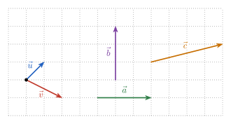
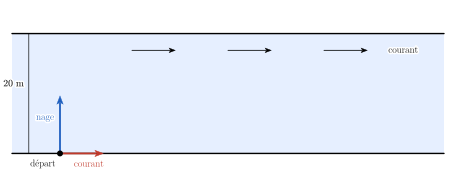
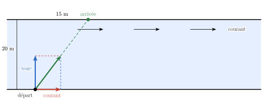

<!-- RENFORCEMENT : variations du socle (même compétence, entraînement en plus).
     Faisable SANS calculatrice ; valeurs différentes du socle.
     Numéro AUTOMATIQUE (catégorie Renforcement -> R.1, R.2…). Échelle d'aides courte :
     un onglet « Indice » (référence + coup de pouce), puis « Solution » (et « Piège » au besoin). -->

::: {.callout-note appearance="simple"}
Ces exercices restent **dans les objectifs** de la séance : à faire une fois le socle et le transfert
bouclés, en séance ou à la maison.
:::

### Renforcement — le socle, un cran plus loin

::: {.callout-caution .exo title="Exercice|Renforcement|2|O2"}
Écrire comme un seul vecteur, pour des points $A$, $B$, $C$, $D$, $M$ quelconques.

(a) $\overrightarrow{AB} + \overrightarrow{BC} + \overrightarrow{CD}$
(b) $\overrightarrow{AB} - \overrightarrow{CB}$
(c) $\overrightarrow{AB} + \overrightarrow{BA}$
(d) $\overrightarrow{MA} - \overrightarrow{MB}$
:::

::: {.aides}
::: {.panel-tabset}

## Indice

Retourne à la théorie du cours : *Addition* et *Produit par un scalaire*.
Enchaîne les déplacements : $\overrightarrow{AB} + \overrightarrow{BC} = \overrightarrow{AC}$. Retrancher
$\overrightarrow{CB}$, c'est ajouter $\overrightarrow{BC}$.

## Solution

(a) $\overrightarrow{AD}$ : on va de $A$ à $B$, puis à $C$, puis à $D$.
(b) $\overrightarrow{AB} + \overrightarrow{BC} = \overrightarrow{AC}$.
(c) $\overrightarrow{AA} = \vec 0$ : un aller-retour ramène au point de départ.
(d) $\overrightarrow{MA} + \overrightarrow{BM} = \overrightarrow{BM} + \overrightarrow{MA} = \overrightarrow{BA}$.

## Piège

En (d), répondre $\overrightarrow{AB}$ : le signe « moins » inverse le sens de $\overrightarrow{MB}$.

:::
:::

::: {.callout-caution .exo title="Exercice|Renforcement|2|O2"}
Écrire chacun des vecteurs $\vec a$, $\vec b$ et $\vec c$ sous la forme $\alpha\,\vec u + \beta\,\vec v$, avec
$\alpha$ et $\beta$ réels.

{fig-alt="Vecteurs u, v, a, b et c sur un quadrillage" width="9.3cm" fig-align="center"}
:::

::: {.aides}
::: {.panel-tabset}

## Indice

Retourne à la théorie du cours : *Coordonnées cartésiennes*. Lis les coordonnées de tous les vecteurs,
puis écris l'égalité coordonnée par coordonnée : tu obtiens un système de deux équations en $\alpha$ et
$\beta$ (séance 3).

## Solution

On lit $\vec u = (1, 1)$, $\vec v = (2, -1)$, $\vec a = (3, 0)$, $\vec b = (0, 3)$ et $\vec c = (4, 1)$.

- $\vec a$ : $\alpha + 2\beta = 3$ et $\alpha - \beta = 0$, donc $\alpha = \beta = 1$ : $\vec a = \vec u + \vec v$.
- $\vec b$ : $\alpha + 2\beta = 0$ et $\alpha - \beta = 3$, donc $\beta = -1$, $\alpha = 2$ : $\vec b = 2\vec u - \vec v$.
- $\vec c$ : $\alpha + 2\beta = 4$ et $\alpha - \beta = 1$, donc $\beta = 1$, $\alpha = 2$ : $\vec c = 2\vec u + \vec v$.

Contrôle graphique : mets les flèches bout à bout sur le quadrillage.

:::
:::

::: {.callout-caution .exo title="Exercice|Renforcement|2|O2"}
(a) Trouver $k$ pour que $(k, -4)$ soit colinéaire à $(3, 6)$.
(b) Les points $A = (1, 2)$, $B = (3, 5)$ et $C = (7, 11)$ sont-ils alignés ?
:::

::: {.aides}
::: {.panel-tabset}

## Indice

Retourne à la théorie du cours : *Colinéarité*. Trois points sont alignés quand
$\overrightarrow{AB}$ et $\overrightarrow{AC}$ sont colinéaires.

## Solution

(a) Il faut $(k, -4) = \lambda\,(3, 6)$ : la seconde coordonnée donne $\lambda = -\dfrac46 = -\dfrac23$,
puis $k = 3\lambda = -2$.
(b) $\overrightarrow{AB} = (2, 3)$ et $\overrightarrow{AC} = (6, 9) = 3\,\overrightarrow{AB}$ : colinéaires,
donc les trois points sont **alignés**. (On retrouve la même pente $\tfrac32$ qu'à la séance 3.)

:::
:::

::: {.callout-caution .exo title="Exercice|Renforcement|2|O2"}
Une bactérie nage à la vitesse $(2, -1)$ µm/s par rapport au fluide qui l'entoure, et ce fluide est
entraîné à la vitesse $(1, 3)$ µm/s.

(a) Calculer sa vitesse résultante.
(b) Calculer son déplacement après $5$ s.
(c) Calculer la valeur de sa vitesse.
(d) Décrire qualitativement sa direction par rapport à l'axe des $x$.
:::

::: {.aides}
::: {.panel-tabset}

## Indice

Retourne à la théorie du cours : *Addition*, *Produit par un scalaire*, *Norme d'un vecteur* et
*Coordonnées et direction*. Les signes des coordonnées donnent le quadrant ; $\tan\theta = \dfrac{v_y}{v_x}$
situe la direction dans ce quadrant.

## Solution

(a) $\vec v = (2, -1) + (1, 3) = (3, 2)$ µm/s.
(b) $\vec d = 5 \cdot (3, 2) = (15, 10)$ µm.
(c) $\left\Vert \vec v \right\Vert = \sqrt{9 + 4} = \sqrt{13} \approx 3{,}6$ µm/s.
(d) Les deux coordonnées sont positives : premier quadrant. $\tan\theta = \dfrac23 < 1 = \tan 45°$, donc
$\theta < 45°$ : la bactérie avance surtout selon l'axe des $x$, en montant légèrement.

## Piège

Additionner les normes des deux vitesses au lieu des vecteurs.

:::
:::

::: {.callout-caution .exo title="Exercice|Renforcement|3|O2"}
Un poisson traverse une rivière de $20$ m de large. Il nage perpendiculairement aux rives à $0{,}4$ m/s
(par rapport à l'eau), et le courant l'entraîne à $0{,}3$ m/s parallèlement aux rives.

{fig-alt="Rivière de 20 m ; vitesse de nage perpendiculaire aux rives et vitesse du courant" width="12.4cm" fig-align="center"}

On prend l'axe des $x$ dans le sens du courant et l'axe des $y$ vers l'autre rive.

(a) Calculer la vitesse du poisson par rapport à la rive : ses coordonnées et sa norme.
(b) Combien de temps met-il pour traverser ?
(c) À quelle distance en aval de son point de départ arrive-t-il ?
(d) Un autre poisson nage à $0{,}6$ m/s et veut arriver **juste en face** de son point de départ.
Dans quelle direction doit-il nager ?
:::

::: {.aides}
::: {.panel-tabset}

## Indice

Retourne à la théorie du cours : *Addition* et *Norme d'un vecteur*. La vitesse par rapport à la rive est
la somme $(0, 0{,}4) + (0{,}3, 0)$ ; seule sa composante selon $y$ rapproche le poisson de l'autre rive.

## Solution

(a) $\vec v = (0{,}3 ;\ 0{,}4)$ et $\left\Vert \vec v \right\Vert = \sqrt{0{,}09 + 0{,}16} = \sqrt{0{,}25} = 0{,}5$ m/s.

(b) Seule la composante selon $y$ fait traverser : $t = \dfrac{20}{0{,}4} = 50$ s. Le courant ne change
pas ce temps.

(c) Pendant ces $50$ s, le courant l'entraîne de $0{,}3 \cdot 50 = 15$ m vers l'aval.

{fig-alt="Vitesse résultante et trajectoire : arrivée 15 m en aval" width="12.4cm" fig-align="center"}

(d) Il doit nager en remontant le courant : sa vitesse de nage a une composante $-0{,}3$ m/s selon $x$.
Si $\alpha$ est l'angle entre sa direction de nage et la perpendiculaire aux rives,
$\sin\alpha = \dfrac{0{,}3}{0{,}6} = \dfrac12$, donc $\alpha = 30°$, vers l'amont.

## Piège

Diviser la largeur par la norme $0{,}5$ m/s : la trajectoire est oblique et plus longue que $20$ m. On
obtient le temps avec la seule composante perpendiculaire aux rives.

:::
:::

::: {.callout-caution .exo title="Exercice|Renforcement|2|O3"}
(a) Une vitesse de norme $10$ m/s fait un angle de $45°$ avec l'axe des $x$. Donner ses coordonnées.
(b) Une force de norme $6$ N fait un angle de $240°$ avec l'axe des $x$. Donner ses coordonnées.
(c) Donner la norme de $\vec w = (\sqrt3, -1)$ et l'angle qu'il fait avec l'axe des $x$.
:::

::: {.aides}
::: {.panel-tabset}

## Indice

Retourne à la théorie du cours : *De la norme aux coordonnées*. Un vecteur de norme $r$ et d'angle $\theta$
s'écrit $r\,(\cos\theta,\ \sin\theta)$. Le quadrant fixe les signes.

## Solution

(a) $10\left(\dfrac{\sqrt2}{2},\ \dfrac{\sqrt2}{2}\right) = \left(5\sqrt2,\ 5\sqrt2\right)$.
(b) $240° = 180° + 60°$ (troisième quadrant) : $6\left(-\dfrac12,\ -\dfrac{\sqrt3}{2}\right) = \left(-3,\ -3\sqrt3\right)$.
(c) $\left\Vert \vec w \right\Vert = \sqrt{3 + 1} = 2$ ; $\cos\theta = \dfrac{\sqrt3}{2}$ et $\sin\theta = -\dfrac12$, donc
$\theta = 330°$ (ou $-30°$).

## Piège

En (b), oublier que cosinus **et** sinus sont négatifs au troisième quadrant.

:::
:::

::: {.callout-caution .exo title="Exercice|Renforcement|2|O3"}
Sans calculatrice, donner le quadrant, $\tan\theta$ et l'angle $\theta \in [0°, 360°[$ que fait chaque
vecteur avec l'axe des $x$.

(a) $(3, 3)$
(b) $(-\sqrt3, 1)$
(c) $(-2, -2)$
(d) $(1, -\sqrt3)$
:::

::: {.aides}
::: {.panel-tabset}

## Indice

Retourne à la théorie du cours : *Coordonnées et direction*. Les signes des coordonnées fixent le
quadrant, puis $\tan\theta = \dfrac{v_y}{v_x}$ et les valeurs remarquables donnent l'angle.

## Solution

(a) Quadrant I, $\tan\theta = 1$ : $\theta = 45°$.
(b) Quadrant II, $\tan\theta = -\dfrac{1}{\sqrt3} = -\dfrac{\sqrt3}{3}$ : $\theta = 180° - 30° = 150°$.
(c) Quadrant III, $\tan\theta = 1$ : $\theta = 180° + 45° = 225°$.
(d) Quadrant IV, $\tan\theta = -\sqrt3$ : $\theta = 360° - 60° = 300°$.

## Piège

Conclure avec la seule tangente : (a) et (c) ont la même tangente mais des sens opposés. C'est le
quadrant qui tranche.

:::
:::

::: {.callout-caution .exo title="Exercice|Renforcement|2|O3"}
(a) Soient $A = (1, 2, 3)$ et $B = (3, 3, 5)$. Calculer $\overrightarrow{AB}$ et la distance $\left\Vert \overrightarrow{AB} \right\Vert$.
(b) Donner le vecteur unitaire de même direction et de même sens que $\overrightarrow{AB}$.
(c) Dans $\mathbb{R}^4$, calculer la distance entre $(1, 0, 2, 1)$ et $(2, 2, 4, 5)$.
:::

::: {.aides}
::: {.panel-tabset}

## Indice

Retourne à la théorie du cours : *Passage à $\mathbb{R}^3$ et $\mathbb{R}^n$*. La distance entre deux
points est la norme du vecteur qui les relie.

## Solution

(a) $\overrightarrow{AB} = (2, 1, 2)$ et $\left\Vert \overrightarrow{AB} \right\Vert = \sqrt{4 + 1 + 4} = 3$.
(b) $\dfrac13\,(2, 1, 2) = \left(\dfrac23,\ \dfrac13,\ \dfrac23\right)$.
(c) Le vecteur qui relie les deux points est $(1, 2, 2, 4)$ ; sa norme vaut $\sqrt{1 + 4 + 4 + 16} = 5$.

:::
:::

::: {.callout-caution .exo title="Exercice|Renforcement|2|O2"}
(a) Calculer l'angle entre $\vec u = (1, 1, 0)$ et $\vec v = (1, 0, 1)$.
(b) Trouver $a$ pour que $(2, a, 1)$ et $(1, -1, 4)$ soient orthogonaux.
:::

::: {.aides}
::: {.panel-tabset}

## Indice

Retourne à la théorie du cours : *Passage à $\mathbb{R}^3$ et $\mathbb{R}^n$* et *Angles via le produit scalaire*. Dans
$\mathbb{R}^3$, $\vec u \cdot \vec v = u_1 v_1 + u_2 v_2 + u_3 v_3$.

## Solution

(a) $\vec u \cdot \vec v = 1$, $\left\Vert \vec u \right\Vert = \left\Vert \vec v \right\Vert = \sqrt2$, donc
$\cos\theta = \dfrac{1}{2}$ et $\theta = 60°$.
(b) $2 - a + 4 = 0$, donc $a = 6$.

:::
:::

::: {.callout-caution .exo title="Exercice|Renforcement|3|O2"}
Soient $\vec i = (1, 0)$, $\vec j = (0, 1)$ et $\vec u = (3, 4)$.

(a) Calculer $\vec u \cdot \vec i$ et $\vec u \cdot \vec j$. Que retrouve-t-on ?
(b) Soit $\vec w = (4, 3)$. Calculer la longueur de la projection orthogonale de $\vec u$ sur la droite
qui porte $\vec w$.
:::

::: {.aides}
::: {.panel-tabset}

## Indice

Retourne à la théorie du cours : *Produit scalaire via les angles*. La longueur de la projection de
$\vec u$ sur la droite de $\vec w$ vaut $\left\Vert \vec u \right\Vert\cos\theta = \dfrac{\vec u \cdot \vec w}{\left\Vert \vec w \right\Vert}$.

## Solution

(a) $\vec u \cdot \vec i = 3$ et $\vec u \cdot \vec j = 4$ : on retrouve les **coordonnées** de $\vec u$.
Chaque coordonnée est la projection de $\vec u$ sur un axe, puisque $\vec i$ et $\vec j$ sont de norme $1$.
(b) $\vec u \cdot \vec w = 12 + 12 = 24$ et $\left\Vert \vec w \right\Vert = 5$ : la projection mesure
$\dfrac{24}{5} = 4{,}8$. Contrôle : c'est un peu moins que $\left\Vert \vec u \right\Vert = 5$, car $\vec u$ et
$\vec w$ font un petit angle.

:::
:::

::: {.callout-caution .exo title="Exercice|Renforcement|3|O2"}
(a) Pour trois vecteurs $\vec u$, $\vec v$, $\vec w$ du plan, l'expression $\vec u \cdot (\vec v \cdot \vec w)$
a-t-elle un sens ? Et $(\vec u \cdot \vec v)\,\vec w$ ?
(b) Montrer qu'aucun vecteur non nul $\vec w$ de $\mathbb{R}^2$ n'est orthogonal à la fois à
$\vec u = (1, 2)$ et à $\vec v = (3, -1)$.
:::

::: {.aides}
::: {.panel-tabset}

## Indice

Retourne à la théorie du cours : *Propriétés du produit scalaire* et *Orthogonalité*. En (a), demande-toi
ce que donne le produit entre parenthèses. En (b), pose $\vec w = (w_x, w_y)$ : deux conditions
d'orthogonalité donnent un système (séance 3).

## Solution

(a) $\vec v \cdot \vec w$ est un **scalaire** : $\vec u \cdot (\vec v \cdot \vec w)$ demanderait le produit scalaire
d'un vecteur par un nombre, ce qui n'est **pas défini**. En revanche, $(\vec u \cdot \vec v)\,\vec w$ est le
produit du nombre $\vec u \cdot \vec v$ par le vecteur $\vec w$ : c'est un vecteur, bien défini.
(b) Il faut $\vec u \cdot \vec w = w_x + 2w_y = 0$ et $\vec v \cdot \vec w = 3w_x - w_y = 0$. La seconde
donne $w_y = 3w_x$ ; dans la première, $w_x + 6w_x = 0$, donc $w_x = 0$ puis $w_y = 0$. Seul $\vec 0$
convient : comme $\vec u$ et $\vec v$ ne sont pas colinéaires, aucune direction du plan n'est
perpendiculaire aux deux.

## Piège

Parler d'« associativité » du produit scalaire : la question ne se pose même pas, puisque l'une des
deux écritures n'a pas de sens.

:::
:::

::: {.callout-caution .exo title="Exercice|Renforcement|1|O2"}
Soient $\vec i = (1, 0, 0)$, $\vec j = (0, 1, 0)$ et $\vec k = (0, 0, 1)$. Calculer
$\vec i \times \vec j$, $\vec j \times \vec k$, $\vec k \times \vec i$ et $\vec j \times \vec i$, puis vérifier
chaque résultat avec la règle de la main droite.
:::

::: {.aides}
::: {.panel-tabset}

## Indice

Retourne à la théorie du cours : *Produit vectoriel dans $\mathbb{R}^3$*. Le produit vectoriel est
orthogonal aux deux vecteurs, sa norme est l'aire du parallélogramme (ici un carré de côté $1$) et son
sens est donné par la règle de la main droite.

## Solution

$\vec i \times \vec j = \vec k$, $\vec j \times \vec k = \vec i$, $\vec k \times \vec i = \vec j$ et
$\vec j \times \vec i = -\vec k$.
:::
:::
