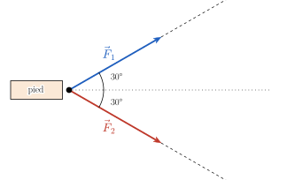
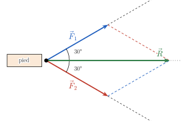
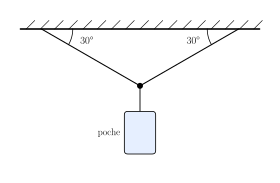
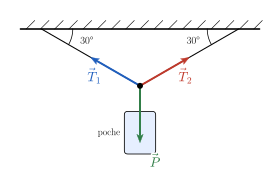
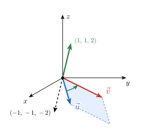

<!-- TRANSFERT : appliquer les savoir-faire du socle à un contexte nouveau.
     Fil rouge : les FORCES (problème initial du cours). Faisable SANS calculatrice.
     HIÉRARCHIE DES INDICES : 1 = théorie ; 2 = une QUESTION (pas la réponse) ; 3 = une ÉTAPE.
     Numéro AUTOMATIQUE (catégorie Transfert -> T.1, T.2…). -->

::: {.callout-caution .exo title="Exercice|Transfert|2|O3"}
Pour une traction orthopédique[^1] de la jambe, deux brins d'une même corde tirent sur le pied. Chaque
brin exerce une force de norme $40$ N et fait un angle de $30°$ avec l'axe de la jambe (horizontal),
l'un vers le haut, l'autre vers le bas.

[^1]: Technique qui exerce une force de tirage continue sur un membre, par exemple pour maintenir
alignés les fragments d'un os fracturé.

{fig-alt="Deux forces F1 et F2 appliquées au pied, à 30 degrés de part et d'autre de l'horizontale" width="9.1cm" fig-align="center"}

On place l'origine du repère au point de contact entre le pied et les brins. On prend l'axe des $x$ horizontal (vers la droite) et l'axe des $y$ vertical (vers le haut).

(a) Donner les coordonnées de $\vec F_1$ et de $\vec F_2$.
(b) Calculer la résultante $\vec R = \vec F_1 + \vec F_2$ : ses coordonnées, sa norme et sa direction.
(c) La norme de $\vec R$ est inférieure à $40 + 40 = 80$ N. Pourquoi ?
(d) Que devient $\left\Vert \vec R \right\Vert$ si les brins font chacun $60°$ avec l'horizontale ?
:::

::: {.aides}
::: {.panel-tabset}

## Indice 1

Retourne à la théorie du cours : *De la norme aux coordonnées* et *Addition*.

## Indice 2

*Question à te poser.*

Quelle partie de chaque force tire **dans l'axe** de la jambe, et quelle partie tire vers le haut ou
vers le bas ? Que deviennent ces parties quand on additionne les deux forces ?

## Indice 3

*Étape.*

$\vec F_1 = 40\,(\cos 30°,\ \sin 30°)$ et $\vec F_2 = 40\,(\cos(-30°),\ \sin(-30°))$. Additionne
ensuite coordonnée par coordonnée.

## Solution

(a) $\vec F_1 = 40\left(\dfrac{\sqrt3}{2},\ \dfrac12\right) = \left(20\sqrt3,\ 20\right)$ et
$\vec F_2 = \left(20\sqrt3,\ -20\right)$.

(b) $\vec R = \left(40\sqrt3,\ 0\right)$ : les composantes verticales s'annulent. $\vec R$ est
**horizontale**, dans l'axe de la jambe, et $\left\Vert \vec R \right\Vert = 40\sqrt3 \approx 69$ N.

{fig-alt="Résultante R, diagonale du parallélogramme construit sur F1 et F2" width="9.1cm" fig-align="center"}

(c) Les deux forces ne sont pas alignées : une partie de chacune (la composante verticale, $20$ N) est
« perdue » car compensée par l'autre. On n'atteindrait $80$ N que si les deux brins tiraient dans la
même direction et le même sens.

(d) $\vec R = 2 \cdot 40\,(\cos 60°,\ 0) = (40, 0)$, soit $\left\Vert \vec R \right\Vert = 40$ N : plus les brins
s'écartent, moins la traction est efficace.

## Piège

Additionner les **normes** ($40 + 40 = 80$ N) au lieu des **vecteurs** ; oublier le signe de la
composante verticale de $\vec F_2$.

:::
:::

::: {.callout-caution .exo title="Exercice|Transfert|3|O2"}
Une poche de perfusion de poids $10$ N est suspendue par deux fils attachés au plafond. Chaque fil fait
un angle de $30°$ avec le plafond. La poche est immobile : la somme des forces qui s'exercent au point
d'attache est nulle, $\vec T_1 + \vec T_2 + \vec P = \vec 0$.

{fig-alt="Poche suspendue à deux fils faisant 30 degrés avec le plafond" width="7.9cm" fig-align="center"}

On place l'origine du repère au point d'attache. On prend l'axe des $x$ horizontal (vers la droite) et l'axe des $y$ vertical (vers le haut).

(a) Représenter les trois forces qui s'exercent au point d'attache : le poids $\vec P$ et les tensions
$\vec T_1$ et $\vec T_2$ des deux fils.
(b) Par symétrie, $\left\Vert \vec T_1 \right\Vert = \left\Vert \vec T_2 \right\Vert = T$. Calculer $T$, en utilisant l'équation $\vec T_1 + \vec T_2 + \vec P = \vec 0$.
(c) Chaque fil supporte-t-il la moitié du poids ? Expliquer.
(d) Que vaudrait $T$ si les deux fils étaient verticaux ? Et que se passe-t-il si on tend les fils
presque à l'horizontale ?
:::

::: {.aides}
::: {.panel-tabset}

## Indice 1

Retourne à la théorie du cours : *Addition* et *De la norme aux coordonnées*.

## Indice 2

*Question à te poser.*

Dans quelle direction chaque tension agit-elle, et quelles sont donc ses coordonnées en fonction de
$T$ ? Que signifie « somme nulle » pour chaque coordonnée ?

## Indice 3

*Étape.*

$\vec T_1 = T\,(-\cos 30°,\ \sin 30°)$, $\vec T_2 = T\,(\cos 30°,\ \sin 30°)$ et $\vec P = (0, -10)$.

## Solution

(a)

{fig-alt="Forces au point d'attache : T1 et T2 le long des fils, P vers le bas" width="7.9cm" fig-align="center"}

(b) Horizontalement, $-T\cos 30° + T\cos 30° = 0$ : c'est automatique, par symétrie.
Verticalement, $T\sin 30° + T\sin 30° - 10 = 0$, soit $2T \cdot \dfrac12 = 10$, donc $T = 10$ N.

(c) **Non** : chaque fil supporte $10$ N, autant que le poids entier. Seule la composante verticale
de chaque tension ($T\sin 30° = 5$ N) porte la poche ; les composantes horizontales tirent l'une contre
l'autre et se compensent.

(d) Si les fils sont verticaux, alors $\vec T_1=\vec T_2$. Donc l'équation  $\vec T_1 + \vec T_2 + \vec P = \vec 0$ donne $2\vec T_1 = -\vec P$. On en déduit que $2T=P$, où $T$ est la norme de $\vec T_1$ et $P$ est la norme de $\vec P$. Donc $T = 5$ N (chaque fil porte bien la moitié). 

En reprenant le raisonnement de (b) avec un angle $\theta$ arbitraire au lieu de $30^\circ$, on obtient que $T=\dfrac{10}{2\sin\theta}$. Donc plus les fils sont
proches de l'horizontale, c'est-à-dire plus $\theta$ est proche de $0^\circ$, plus $\sin\theta$ est proche de $0$ et plus $T = \dfrac{10}{2\sin\theta}$ devient
grand. La tension devient donc de plus en plus forte, ce qui pourrait faire rompre le fil.

## Piège

Supposer que chaque fil porte la moitié du poids sans tenir compte de l'angle ; écrire l'équilibre
avec les normes au lieu des composantes.

:::
:::

::: {.callout-caution .exo title="Exercice|Transfert|3|O2"}

Soient $\vec u = (1, 1, -1)$ et $\vec v = (0, 2, -1)$.

a. On cherche à déterminer $\vec u \times \vec v$.

   1. On pose $\vec w = \vec u \times \vec v = (x,y,z)$.  
   Quelles propriétés géométriques permettent de caractériser la direction de $\vec w$ ?
   2. Traduire ces propriétés à l'aide de produits scalaires et obtenir un système d'équations vérifié par $x,y,z$.
   3. Résoudre ce système et montrer que $\vec w$ est de la forme
   $$
   \vec w=\lambda(1,1,2).
   $$
   4. Quelle information supplémentaire permet de déterminer la valeur de $\lambda$ ? Calculer la norme de $\vec u\times\vec v$ à partir de la définition du produit vectoriel.
   5. Il reste à déterminer le sens de $\vec w$. La figure ci-dessous représente $\vec u$, $\vec v$ et les deux
   candidats $(1, 1, 2)$ et $(-1, -1, -2)$. Utiliser la **règle de la main droite** pour déterminer si $\lambda$
   est positif ou négatif.

      {fig-alt="Repère x, y, z ; u = (1, 1, −1) et v = (0, 2, −1) sous le plan (x, y), flèche courbe de u vers v ; candidats (1, 1, 2) vers le haut et (−1, −1, −2) vers le bas" width="6.9cm" fig-align="center"}
   6. Vérifier que le vecteur obtenu est bien orthogonal à $\vec u$ et à $\vec v$.

b. En déduire $\vec v \times \vec u$ sans refaire de calcul.

c. Que vaut $\vec u \times (2\vec u)$ ? Pourquoi ?

:::

::: {.aides}

::: {.panel-tabset}

## Indice 1

Retourne à la théorie du cours : *Produit vectoriel dans $\mathbb{R}^3$*.

## Indice 2

*Question à te poser.*

Dans quelle direction pointe le produit vectoriel $\vec u\times\vec v$ ?

## Indice 3

*Étape.*

Une étape par sous-question :

1. $\vec u\times\vec v$ est perpendiculaire à $\vec u$ et à $\vec v$.
2. Si $\vec w=(x,y,z)$, traduire ces deux perpendicularités par deux produits scalaires nuls.
3. Résoudre le système obtenu.
4. Utiliser
   $$
   \left\Vert \vec u\times\vec v \right\Vert
   =\left\Vert \vec u \right\Vert\,\left\Vert \vec v \right\Vert\,\sin\theta.
   $$
5. Pour choisir entre les deux sens possibles, utilise la figure et la **règle de la main droite** : les doigts suivent la flèche courbe, de $\vec u$ vers $\vec v$ par l'angle le plus court ; le pouce indique le sens de $\vec u\times\vec v$.
6. Effectuer les deux produits scalaires pour contrôler.

## Solution

a. Soit $\vec w=(x,y,z)$.

   1. Par définition, $\vec u\times\vec v$ est perpendiculaire à $\vec u$ et à $\vec v$.
   2. Avec $\vec w=(x,y,z)$ :

   $$
   \begin{cases}
   \vec w\cdot\vec u=0\\
   \vec w\cdot\vec v=0
   \end{cases}
   $$

   donc

   $$
   \begin{cases}
   x+y-z=0\\
   2y-z=0.
   \end{cases}
   $$

   3. La seconde équation donne $z=2y$ ; dans la première, $x=z-y=y$. Ainsi,

   $$
   \vec w=(y,y,2y)=y(1,1,2).
   $$

   4. On calcule $\left\Vert \vec u \right\Vert=\sqrt3$ et $\left\Vert \vec v \right\Vert=\sqrt5$. De plus $\vec u\cdot\vec v=0+2+1=3$. Donc

   $$
   \cos\theta=\frac{3}{\sqrt3\,\sqrt5}=\frac{3}{\sqrt{15}}.
   $$

   Comme $\sin^2\theta+\cos^2\theta=1$ et $\sin\theta\ge0$ (car $\theta\in[0,\pi]$), on a

   $$
   \sin\theta
   =\sqrt{1-\frac{9}{15}}
   =\sqrt{\frac{6}{15}}.
   $$

   Ainsi,

   $$
   \left\Vert \vec u\times\vec v \right\Vert
   =\sqrt{15}\,\sqrt{\frac{6}{15}}
   =\sqrt6.
   $$

   5. Puisque $\vec w=y(1,1,2)$,

   $$
   \left\Vert \vec w \right\Vert=|y|\left\Vert (1,1,2) \right\Vert=|y|\sqrt6.
   $$

   Donc $|y|=1$, par le point 4.

   Il reste à choisir entre les deux vecteurs possibles :

   $$
   (1,1,2)
   \qquad\text{ou}\qquad
   (-1,-1,-2).
   $$

   D'après la **règle de la main droite**, lorsque les doigts de la main droite tournent de $\vec u$ vers $\vec v$ par l'angle le plus court, le pouce indique le sens de $\vec u\times\vec v$.

   Sur la figure, $\vec u$ et $\vec v$ pointent sous le plan $(x, y)$, et la flèche courbe qui va de $\vec u$
   vers $\vec v$ tourne dans le sens inverse des aiguilles d'une montre. Les doigts de la main droite suivent
   cette flèche : le pouce monte, du côté des $z$ positifs. C'est le cas de $(1, 1, 2)$, dont la
   coordonnée $z$ vaut $2 > 0$, et non de $(-1, -1, -2)$.

   Ainsi $y=1$ et

   $$
   {\vec u\times\vec v=(1,1,2)}.
   $$

   6. Contrôle de l'orthogonalité :

   $$
   (1,1,2)\cdot(1,1,-1)=1+1-2=0
   $$

   et

   $$
   (1,1,2)\cdot(0,2,-1)=0+2-2=0.
   $$

b. On a $\vec v\times\vec u=-\,\vec u\times\vec v$. Donc ${\vec v\times\vec u=(-1,-1,-2)}$.

c. ${\vec u\times(2\vec u)=\vec0}$. En effet, $\vec u$ et $2\vec u$ sont colinéaires : le parallélogramme qu'ils forment est aplati et son aire est nulle.

## Piège

La perpendicularité permet de déterminer la **direction** du produit vectoriel, mais pas encore sa longueur ni son sens.

Il faut donc compléter avec les deux autres éléments de la définition :

- la **norme** $\left\Vert \vec u\times\vec v \right\Vert$ ;
- le **sens**, déterminé par la **règle de la main droite**.

Attention également : la règle de la main droite donne le sens de $\vec u\times\vec v$, tandis que celui de $\vec v\times\vec u$ est le sens opposé.

:::

:::