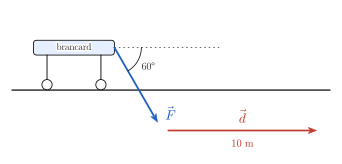
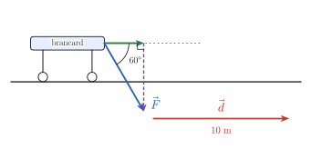
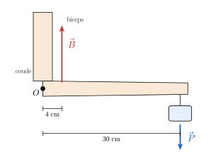

<!-- TRANSFERT : appliquer les savoir-faire du socle à un contexte nouveau.
     Fil rouge : les FORCES (problème initial du cours). Faisable SANS calculatrice.
     HIÉRARCHIE DES INDICES : 1 = théorie ; 2 = une QUESTION (pas la réponse) ; 3 = une ÉTAPE.
     Numéro AUTOMATIQUE (catégorie Transfert -> T.1, T.2…). -->

::: {.callout-caution .exo title="Exercice|Transfert|2|O3"}
Pour une traction orthopédique[^1] de la jambe, deux brins d'une même corde tirent sur le pied. Chaque
brin exerce une force de norme $40$ N et fait un angle de $30°$ avec l'axe de la jambe (horizontal),
l'un vers le haut, l'autre vers le bas.

[^1]: Technique qui exerce une force de tirage continue sur un membre, par exemple pour maintenir
alignés les fragments d'un os fracturé.

{fig-alt="Deux forces F1 et F2 appliquées au pied, à 30 degrés de part et d'autre de l'horizontale" width="9.1cm" fig-align="center"}

On prend l'axe des $x$ horizontal (vers la droite) et l'axe des $y$ vertical (vers le haut).

(a) Donner les coordonnées de $\vec F_1$ et de $\vec F_2$.
(b) Calculer la résultante $\vec R = \vec F_1 + \vec F_2$ : ses coordonnées, sa norme et sa direction.
(c) La norme de $\vec R$ est inférieure à $40 + 40 = 80$ N. Pourquoi ?
(d) Que devient $\left\Vert \vec R \right\Vert$ si les brins font chacun $60°$ avec l'horizontale ?
:::

::: {.aides}
::: {.panel-tabset}

## Indice 1

Retourne à la théorie du cours : *Coordonnées cartésiennes* et *Addition, soustraction et multiplication par un scalaire*.

## Indice 2

*Question à te poser.*

Quelle partie de chaque force tire **dans l'axe** de la jambe, et quelle partie tire vers le haut ou
vers le bas ? Que deviennent ces parties quand on additionne les deux forces ?

## Indice 3

*Étape.*

$\vec F_1 = 40\,(\cos 30°,\ \sin 30°)$ et $\vec F_2 = 40\,(\cos(-30°),\ \sin(-30°))$. Additionne
ensuite coordonnée par coordonnée.

## Solution

(a) $\vec F_1 = 40\left(\dfrac{\sqrt3}{2},\ \dfrac12\right) = \left(20\sqrt3,\ 20\right)$ et
$\vec F_2 = \left(20\sqrt3,\ -20\right)$.

(b) $\vec R = \left(40\sqrt3,\ 0\right)$ : les composantes verticales s'annulent. $\vec R$ est
**horizontale**, dans l'axe de la jambe, et $\left\Vert \vec R \right\Vert = 40\sqrt3 \approx 69$ N.

{fig-alt="Résultante R, diagonale du parallélogramme construit sur F1 et F2" width="9.1cm" fig-align="center"}

(c) Les deux forces ne sont pas alignées : une partie de chacune (la composante verticale, $20$ N) est
« perdue » car compensée par l'autre. On n'atteindrait $80$ N que si les deux brins tiraient dans la
même direction et le même sens.

(d) $\vec R = 2 \cdot 40\,(\cos 60°,\ 0) = (40, 0)$, soit $\left\Vert \vec R \right\Vert = 40$ N : plus les brins
s'écartent, moins la traction est efficace.

## Piège

Additionner les **normes** ($40 + 40 = 80$ N) au lieu des **vecteurs** ; oublier le signe de la
composante verticale de $\vec F_2$.

:::
:::

::: {.callout-caution .exo title="Exercice|Transfert|3|O2"}
Une poche de perfusion de poids $10$ N est suspendue par deux fils attachés au plafond. Chaque fil fait
un angle de $30°$ avec le plafond. La poche est immobile : la somme des forces qui s'exercent au point
d'attache est nulle, $\vec T_1 + \vec T_2 + \vec P = \vec 0$.

{fig-alt="Poche suspendue à deux fils faisant 30 degrés avec le plafond" width="7.9cm" fig-align="center"}

(a) Représenter les trois forces qui s'exercent au point d'attache : le poids $\vec P$ et les tensions
$\vec T_1$ et $\vec T_2$ des deux fils.
(b) Par symétrie, $\left\Vert \vec T_1 \right\Vert = \left\Vert \vec T_2 \right\Vert = T$. Écrire l'équilibre selon la verticale et
calculer $T$.
(c) Chaque fil supporte-t-il la moitié du poids ? Expliquer.
(d) Que vaudrait $T$ si les deux fils étaient verticaux ? Et que se passe-t-il si on tend les fils
presque à l'horizontale ?
:::

::: {.aides}
::: {.panel-tabset}

## Indice 1

Retourne à la théorie du cours : *Addition, soustraction et multiplication par un scalaire* et
*Coordonnées cartésiennes*.

## Indice 2

*Question à te poser.*

Dans quelle direction chaque tension agit-elle, et quelles sont donc ses coordonnées en fonction de
$T$ ? Que signifie « somme nulle » pour chaque coordonnée ?

## Indice 3

*Étape.*

$\vec T_1 = T\,(-\cos 30°,\ \sin 30°)$, $\vec T_2 = T\,(\cos 30°,\ \sin 30°)$ et $\vec P = (0, -10)$.

## Solution

(a)

{fig-alt="Forces au point d'attache : T1 et T2 le long des fils, P vers le bas" width="7.9cm" fig-align="center"}

(b) Horizontalement, $-T\cos 30° + T\cos 30° = 0$ : c'est automatique, par symétrie.
Verticalement, $T\sin 30° + T\sin 30° - 10 = 0$, soit $2T \cdot \dfrac12 = 10$, donc $T = 10$ N.

(c) **Non** : chaque fil supporte $10$ N, autant que le poids entier. Seule la composante verticale
de chaque tension ($T\sin 30° = 5$ N) porte la poche ; les composantes horizontales tirent l'une contre
l'autre et se compensent.

(d) Fils verticaux : $2T = 10$, donc $T = 5$ N (chaque fil porte bien la moitié). Plus les fils sont
proches de l'horizontale, plus $\sin\theta$ est petit et plus $T = \dfrac{10}{2\sin\theta}$ devient
grand : un fil tendu presque à plat peut casser sous une charge légère.

## Piège

Supposer que chaque fil porte la moitié du poids sans tenir compte de l'angle ; écrire l'équilibre
avec les normes au lieu des composantes.

:::
:::

::: {.callout-caution .exo title="Exercice|Transfert|2|O4"}
Un soignant pousse un brancard sur $10$ m, en ligne droite, sur un sol horizontal. Il exerce une force
$\vec F$ de norme $60$ N, dirigée à $60°$ sous l'horizontale. Le **travail** de la force sur le
déplacement $\vec d$ vaut $W = \vec F \cdot \vec d$ (en joules, si $\vec F$ est en newtons et $\vec d$
en mètres).

{fig-alt="Brancard poussé par une force F à 60 degrés sous l'horizontale, déplacement d de 10 m" width="9.7cm" fig-align="center"}

(a) Calculer $W$ à partir des normes et de l'angle.
(b) Écrire $\vec F$ et $\vec d$ en coordonnées ($x$ vers la droite, $y$ vers le haut) et recalculer $W$.
(c) Quelle partie de la force fait avancer le brancard ? À quoi sert l'autre ?
(d) Pour une même norme de $\vec F$, quelle direction de poussée donnerait le plus grand travail ?
Lequel ?
:::

::: {.aides}
::: {.panel-tabset}

## Indice 1

Retourne à la théorie du cours : *Produit scalaire* et *Projection, angle et orthogonalité*.

## Indice 2

*Question à te poser.*

Quel est l'angle entre $\vec F$ et $\vec d$ ? Et en coordonnées, quel est le signe de la composante
verticale de $\vec F$ ?

## Indice 3

*Étape.*

$W = \left\Vert \vec F \right\Vert\,\left\Vert \vec d \right\Vert\cos 60°$. En coordonnées,
$\vec F = 60\,(\cos(-60°),\ \sin(-60°))$ et $\vec d = (10, 0)$.

## Solution

(a) $W = 60 \cdot 10 \cdot \cos 60° = 600 \cdot \dfrac12 = 300$ J.

(b) $\vec F = \left(30,\ -30\sqrt3\right)$ et $\vec d = (10, 0)$, donc
$W = 30 \cdot 10 + \left(-30\sqrt3\right) \cdot 0 = 300$ J. ✓

(c) Seule la composante **horizontale** ($30$ N), c'est-à-dire la projection de $\vec F$ sur la direction
du déplacement, travaille. La composante verticale plaque le brancard contre le sol : elle est
orthogonale au déplacement et son travail est nul.

{fig-alt="Décomposition de F en une composante horizontale utile et une composante verticale" width="9.7cm" fig-align="center"}

(d) Pousser à l'horizontale ($\cos 0° = 1$) : $W = 60 \cdot 10 = 600$ J, le double.

## Piège

Prendre $\sin 60°$ au lieu de $\cos 60°$ : c'est l'angle **entre** la force et le déplacement qui
compte ; oublier que la composante verticale ne travaille pas.

:::
:::

::: {.callout-caution .exo title="Exercice|Transfert|3|O2"}
Un poisson traverse une rivière de $20$ m de large. Il nage perpendiculairement aux rives à $0{,}4$ m/s
(par rapport à l'eau), et le courant l'entraîne à $0{,}3$ m/s parallèlement aux rives.

{fig-alt="Rivière de 20 m ; vitesse de nage perpendiculaire aux rives et vitesse du courant" width="12.4cm" fig-align="center"}

On prend l'axe des $x$ dans le sens du courant et l'axe des $y$ vers l'autre rive.

(a) Calculer la vitesse du poisson par rapport à la rive : ses coordonnées et sa norme.
(b) Combien de temps met-il pour traverser ?
(c) À quelle distance en aval de son point de départ arrive-t-il ?
(d) Un autre poisson nage à $0{,}6$ m/s et veut arriver **juste en face** de son point de départ.
Dans quelle direction doit-il nager ?
:::

::: {.aides}
::: {.panel-tabset}

## Indice 1

Retourne à la théorie du cours : *Addition, soustraction et multiplication par un scalaire* et
*Coordonnées cartésiennes*.

## Indice 2

*Question à te poser.*

Quelle composante de la vitesse rapproche le poisson de l'autre rive ? Le courant change-t-il le temps
de traversée ?

## Indice 3

*Étape.*

La vitesse par rapport à la rive est la somme $(0, 0{,}4) + (0{,}3, 0)$. En (d), la vitesse de nage doit
avoir une composante $-0{,}3$ m/s selon $x$ pour annuler le courant.

## Solution

(a) $\vec v = (0{,}3 ;\ 0{,}4)$ et $\left\Vert \vec v \right\Vert = \sqrt{0{,}09 + 0{,}16} = \sqrt{0{,}25} = 0{,}5$ m/s.

(b) Seule la composante selon $y$ fait traverser : $t = \dfrac{20}{0{,}4} = 50$ s. Le courant ne change
pas ce temps.

(c) Pendant ces $50$ s, le courant l'entraîne de $0{,}3 \cdot 50 = 15$ m vers l'aval.

{fig-alt="Vitesse résultante et trajectoire : arrivée 15 m en aval" width="12.4cm" fig-align="center"}

(d) Il doit nager en remontant le courant : sa vitesse de nage a une composante $-0{,}3$ m/s selon $x$.
Si $\alpha$ est l'angle entre sa direction de nage et la perpendiculaire aux rives,
$\sin\alpha = \dfrac{0{,}3}{0{,}6} = \dfrac12$, donc $\alpha = 30°$, vers l'amont.

## Piège

Diviser la largeur par la norme $0{,}5$ m/s : la trajectoire est oblique et plus longue que $20$ m. On
obtient le temps avec la seule composante perpendiculaire aux rives.

:::
:::

::: {.callout-caution .exo title="Exercice|Transfert|3|O5"}
L'avant-bras est tenu à l'horizontale et porte une charge de poids $20$ N, à $30$ cm du coude $O$. Le
biceps s'attache à $4$ cm du coude et tire verticalement vers le haut avec une force $\vec B$.

{fig-alt="Avant-bras horizontal : biceps à 4 cm du coude, charge à 30 cm" width="8.9cm" fig-align="center"}

Le **moment** d'une force $\vec F$ appliquée au point $M$, par rapport à $O$, est
$\overrightarrow{OM} \times \vec F$ ; il décrit l'effet de rotation de la force autour de $O$. On prend
$x$ le long de l'avant-bras, $y$ vers le haut et $z$ vers toi (hors de la feuille). Les longueurs sont
en mètres.

(a) Calculer le moment du poids $\vec P$. Dans quel sens fait-il tourner l'avant-bras ?
(b) L'avant-bras est immobile : la somme des moments de $\vec B$ et $\vec P$ est nulle. Calculer
$\left\Vert \vec B \right\Vert$.
(c) Comparer $\left\Vert \vec B \right\Vert$ au poids porté. Pourquoi une telle différence ?
:::

::: {.aides}
::: {.panel-tabset}

## Indice 1

Retourne à la théorie du cours : *Produit vectoriel*.

## Indice 2

*Question à te poser.*

Quelles sont les coordonnées du point d'application de chaque force, et celles de chaque force ? Le
moment obtenu pointe-t-il vers toi ou s'éloigne-t-il de toi ?

## Indice 3

*Étape.*

Pour le poids : $\overrightarrow{OM} = (0{,}3 ;\ 0 ;\ 0)$ et $\vec P = (0 ;\ -20 ;\ 0)$. Pour le biceps :
$(0{,}04 ;\ 0 ;\ 0)$ et $\vec B = (0 ;\ B ;\ 0)$.

## Solution

(a) $(0{,}3 ;\ 0 ;\ 0) \times (0 ;\ -20 ;\ 0) = \big(0 ;\ 0 ;\ 0{,}3 \cdot (-20) - 0 \cdot 0\big) = (0 ;\ 0 ;\ -6)$,
en N·m. Il s'éloigne de toi : par la règle de la main droite, le poids fait tourner l'avant-bras dans le
sens des aiguilles d'une montre, vers le bas.

(b) Le moment du biceps vaut $(0{,}04 ;\ 0 ;\ 0) \times (0 ;\ B ;\ 0) = (0 ;\ 0 ;\ 0{,}04\,B)$.
Équilibre : $0{,}04\,B - 6 = 0$, donc $B = \dfrac{6}{0{,}04} = 150$ N.

(c) Le biceps tire avec $150$ N pour porter $20$ N, plus de sept fois plus. Il agit tout près du coude
($4$ cm) alors que la charge est loin ($30$ cm) : la norme du moment est « distance $\times$ force »
(quand elles sont perpendiculaires), donc une petite distance impose une grande force.
En contrepartie, un petit raccourcissement du muscle fait parcourir un grand chemin à la main.

## Piège

Inverser l'ordre du produit ($\vec F \times \overrightarrow{OM}$) : le signe du moment change, donc le
sens de rotation annoncé est faux.

:::
:::
