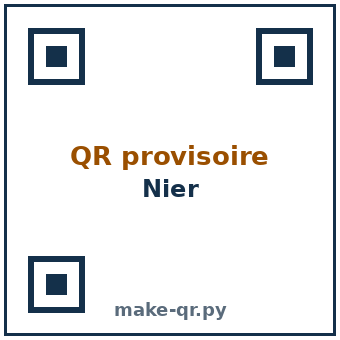

# Présentation {.divider background-color="#14304a"}

## Le déroulé de la séance

<table class="deroule">
<thead><tr><th>Temps</th><th>Durée</th><th>Ce qu'on y fait</th></tr></thead>
<tbody>
<tr><td class="ph">1 · Échauffement</td><td class="du">10 min</td><td>Trois questions rapides projetées. Tu réponds sur papier, puis on vote.</td></tr>
<tr><td class="ph">2 · Socle</td><td class="du">35 min</td><td>Les exercices de base, à ton rythme, en t'auto-corrigeant sur un site.</td></tr>
<tr><td class="ph">3 · Pause</td><td class="du">10 min</td><td>On souffle, on prend un café, ...</td></tr>
<tr><td class="ph">4 · Transfert</td><td class="du">35 min</td><td>Des problèmes en contexte. Ici le travail avec les voisin·es est conseillé.</td></tr>
<tr><td class="ph">5 · Méthode</td><td class="du">20 min</td><td>On dégage ensemble une ou deux méthodes réutilisables.</td></tr>
</tbody>
</table>

## Comment on travaille ensemble

Deux modes de travail:

::: {.modes}
::: {.mode .travail}
::: {.m-titre}
Travail autonome
:::
Seul ou avec tes voisin·es — parler, comparer une réponse, discuter un indice, ... Ce mode de travail engendrera du bruit: on s'entraînera pour le canaliser.
:::
::: {.mode .jeparle}
::: {.m-titre}
Travail collectif
:::
Ce sont les moments où je reprends la parole. Lors de ces moments, j'ai besoin d'un **silence complet**. Ces moments seront les plus courts possibles.
:::
:::

::: {.aretenir .smaller}
**Une seule règle à retenir : seul·es tes voisin·es doivent t'entendre.** On est nombreux. On verra lorsqu'on parlera d'exponentielles et de logarithmes que l'accumulation de bavardage mène vite à un bruit incompatible avec le travail. On veillera donc à maintenir le volume sonore à un niveau raisonnable.
:::

## L'outil qui affiche le niveau sonore

Pendant les moments de travail, un **niveau sonore projeté** tourne en fond sur l'écran. Deux niveaux seulement, et un signal qui ne demande pas de regarder l'écran en continu :

- **Bleu** — c'est bon, on continue.
- **Rouge**, signalé par **un gong** — on baisse le volume d'un cran.

::: {.aretenir .smaller}
Le gong est là pour nous donner un repère, car il est difficile de se rendre compte que le volume est trop haut.

Nous allons calibrer ensemble [l'appli](https://classroomscreen.com/app/p/01df535d-01a3-43cc-ab1a-078cd59695af/0).
:::

## On sera cinq pour vous accompagner

Cinq enseignant·es, pour environ 400 étudiant·es. Conséquences:

- **l'attention qu'on peut vous donner individuellement est comptée**;
- la séance demande, en retour, davantage d'**autonomie** que ce à quoi vous êtes peut-être habitué·es.

::: {.aretenir}
Ça peut **déstabiliser au début**. C'est voulu, et voici pourquoi : les mathématiques s'apprennent comme un langage — en le pratiquant, en se trompant, en corrigeant. Personne n'apprend une langue en écoutant seulement quelqu'un la parler. Le but n'est pas de vous laisser seul·es face à la difficulté, mais de vous **préparer** à vous en sortir par vous-même — à l'examen, vous serez seul·es face aux questions.
:::

## Ce qu'on fait — et ce qu'on ne fait pas

::: {.incremental}
- **On ne donne pas de mini-cours.** Si un point de théorie manque, on te renvoie vers elle plutôt que de la refaire.
- **On ne fait pas l'exercice à ta place.** On te pose des questions, pour que ce soit ton raisonnement qui avance — pas le nôtre.
- **On répondra à « je ne comprends pas » par une question, pas par la solution.** L'objectif : que tu apprennes, progressivement, à t'en sortir seul.
:::

. . .

::: {.aretenir .smaller}
Tu n'es pas laissé·e sans ressource pour autant. Les leviers : les **indices** du site (trois niveaux, avant la solution), ton **voisin**, les **assistant·es** qui te guident, la **remédiation** si les bases manquent, les **méthodes** qu'on dégage en fin de séance — et, si un blocage touche tout le monde, une **mise au point collective**, ponctuelle, faite par moi.
:::

## Le site de la séance

Exercices, indices à trois niveaux, corrections, méthodes : tout est sur le site, accessible pendant toute la séance et après.

::: {.wc-qr .center}

:::

# Échauffement {.divider background-color="#14304a"}

## Les questions 

::: columns
::: {.column width="62%"}
**Q1** [[O3]{.obj}]{style="float:right"} — « $x \ge 0$ » : proposition ou prédicat ?

**Q2** [[O1]{.obj}]{style="float:right"} — traduire « $-7$ est un entier ».

**Q3** [[O2]{.obj}]{style="float:right"} — nier $\forall\, x \in \mathbb{R},\ x^2 > 0$.
:::
::: {.column width="38%"}
::: {.wooclap}
::: {.wc-body}
**Vote sur Wooclap**

::: {.wc-lien}
Code : MSKHLGY
:::
:::
::: {.wc-qr}

:::
:::
:::
:::

::: {.et-timer}

<button id="et-minus" class="et-btn" type="button" aria-label="Retirer une minute">−1 min</button>

04:00

<button id="et-plus" class="et-btn" type="button" aria-label="Ajouter une minute">+1 min</button>

<button id="et-toggle" class="et-btn et-primary" type="button">Démarrer</button>
<button id="et-reset" class="et-btn" type="button" aria-label="Réinitialiser">↺ Réinitialiser</button>

:::

##  Q1 [[O3]{.obj}]{style="float:right"}

On considère l'énoncé :

::: {.big-eq .center}
« $x \ge 0$ »
:::

Est-ce une **proposition** (on peut dire, tel quel, si c'est vrai ou faux) ou un **prédicat** (ça dépend d'une lettre) ?

. . .

::: {.aretenir}
**Prédicat.** La valeur de vérité dépend de $x$ : vrai pour $x = 2$, faux pour $x = -3$. Tant qu'on n'a pas fixé $x$, on ne peut pas trancher.
:::

## Q2 [[O1]{.obj}]{style="float:right"}

Comment traduire en langage formel :

::: {.big-eq .center}
« $-7$ est un entier »
:::

. . .

::: {.aretenir}
$-7 \in \mathbb{Z}$.

On parle d'**un élément** ($-7$) qui **appartient** à un ensemble ($\mathbb{Z}$) : c'est $\in$, pas $\subseteq$. On écrirait $\subseteq$ pour une relation entre **deux ensembles**, comme $\mathbb{N} \subseteq \mathbb{Z}$.
:::

## Q3  [[O2]{.obj}]{style="float:right"}

Quelle est la négation de :

::: {.big-eq .center}
$\forall\, x \in \mathbb{R},\ x^2 > 0$
:::

. . .

::: {.aretenir}
$\exists\, x \in \mathbb{R},\ x^2 \le 0$.

Le $\forall$ devient $\exists$, et la négation de « $> 0$ » est « $\le 0$ » — le cas d'égalité compte. 
:::

# Institutionnalisation {.divider background-color="#14304a"}

## Comment fabriquer une méthode

Pour fabriquer une méthode, il n'y a rien à inventer : on récupère dans le cours et les exercices **les gestes qui reviennent**, et on les met en ordre.

Aujourd'hui, on construit une méthode pour **nier une proposition**. 

Avec tes mots, essaye de donner des étapes pour nier une proposition.

::: {.wooclap}
::: {.wc-play}
▶
:::
::: {.wc-body}
**Ouvre le Wooclap — Nier.** Trois questions ouvertes, une par étape.

::: {.wc-lien}
Code : MQTNSRK
:::
:::
::: {.wc-qr}

Nier
:::
:::

## Un exemple pour construire la méthode

On veut nier cette proposition :

::: {.big-eq .center}
$\forall\, e,\ \big(e > 0 \Rightarrow e^2 > 0\big)$
:::

On va la nier **de l'extérieur vers l'intérieur**, une couche à la fois.

## Étape 1 — repérer la structure

[[1]{.step} **Quel est le connecteur principal, et quels quantificateurs l'entourent ?**]{}

Avant de nier quoi que ce soit, on regarde comment l'énoncé est **construit**.

. . .

::: {.aretenir}
Ici : un **$\forall$** posé autour d'une **implication** ($\Rightarrow$). 
:::

## Étape 2 — faire entrer la négation, une couche à la fois

[[2.1]{.step} **On nie le quantificateur**]{}

La négation d'un $\forall$ est un $\exists$ 

$$\lnot\Big(\forall\, e,\ (e>0 \Rightarrow e^2>0)\Big) \iff \exists\, e,\ \lnot\big(e>0 \Rightarrow e^2>0\big)$$

[[2.2]{.step} **On nie maintenant l'implication.**]{}

$\lnot(\alpha \Rightarrow \beta) \iff \alpha \land \lnot\beta$.

Une implication n'est fausse que dans **un seul** cas : prémisse vraie, conclusion fausse. Donc :

$$\exists\, e,\ \lnot(e>0 \Rightarrow e^2>0) \iff \exists\, e,\ \big(e>0 \ \land\ \lnot(e^2>0)\big)$$

## Étape 3 — nier les propositions sans quantificateurs ni connecteurs

[[3]{.step} **Il ne reste qu'à nier ce qui n'a plus ni connecteur ni quantificateur.**]{}

Les négations « de base » :  $=$ devient $\ne$, $<$ devient $\ge$, $>$ devient $\le$ et $\in$ devient $\notin$.

::: {.aretenir}
$\lnot(e^2 > 0) \iff e^2 \le 0$.

On aboutit à :

::: {.big-eq .center}
$\exists\, e,\ \big(e > 0 \ \land\ e^2 \le 0\big)$
:::
:::

## Le piège à connaître

::: {.piege}
::: {.pg-titre}
Piège
:::
Deux erreurs classiques : **garder le même quantificateur** en niant (laisser un $\forall$ là où il faut un $\exists$) ; et nier une inégalité stricte par une autre stricte — la négation de $>$ n'est **pas** $<$, mais $\le$. On oublie le cas d'égalité.
:::

<!-- 
# Méthode 2 — Traduire une phrase {.divider background-color="#1f5fbf"}

[Elle aussi est passée à l'échauffement. Même façon de faire : on la construit ensemble.]{style="color:#eaf1ff"}

## Ouvre le Wooclap — Traduire

Même principe, en questions ouvertes : trois étapes, tu écris la règle avec tes mots, on la synthétise ensemble.

::: {.wooclap}
::: {.wc-play}
▶
:::
::: {.wc-body}
**Ouvre le Wooclap — Traduire.**

::: {.wc-lien}
lien : REMPLACER_WOOCLAP_TRADUIRE
:::
:::
::: {.wc-qr}

Traduire
:::
:::

## Notre fil rouge

On veut traduire en langage formel :

::: {.big-eq .center}
« Le patient est malade **mais** son test est négatif. »
:::

Comme pour nier, on procède par morceaux, sans se presser.

## Étape 1 — repérer les mots logiques

[[1]{.step} **Où sont les connecteurs et les quantificateurs ?**]{}

Les mots à traquer : « et », « ou », « si… alors », « non »… et les quantificateurs « pour tout », « il existe ».

**Sur Wooclap, en une phrase :** dans notre phrase, par quel connecteur traduire le mot **« mais »** ?

. . .

::: {.aretenir}
« mais » se traduit par **$\land$** (« et »).

Dans la langue, « mais » marque un contraste ; **en logique, il ne dit rien de plus que « et »** : il relie deux faits vrais en même temps.
:::

## Étape 2 — traduire chaque morceau

[[2]{.step} **Une proposition simple → une lettre ; chaque mot logique → son symbole.**]{}

On pose :

::: {.smaller}
$\alpha$ = « le patient est malade »   ·   $\beta$ = « le test est positif »
:::

« et » $\to \land$ · « ou » $\to \lor$ · « non / ne… pas » $\to \lnot$ · « si… alors » $\to \Rightarrow$

. . .

::: {.aretenir}
« négatif » est la **négation** de « positif » : donc $\lnot\beta$.

La phrase devient  $\alpha \land \lnot\beta$.
:::

## Étape 3 — relire pour vérifier le sens

[[3]{.step} **Une traduction se relit toujours.**]{}

Deux réflexes : *qui implique qui ?* (ne pas inverser une implication), et surtout — parle-t-on d'un **élément** dans un ensemble ($\in$) ou d'une relation entre **deux ensembles** ($\subseteq$) ?

**Sur Wooclap, en une phrase :** « tout nombre naturel est un entier » se traduit par $\in$ ou par $\subseteq$ ? Pourquoi ?

. . .

::: {.aretenir}
Par **$\subseteq$** : $\mathbb{N} \subseteq \mathbb{Z}$. On compare **deux ensembles**. On garderait $\in$ pour un seul élément, comme $-7 \in \mathbb{Z}$ (l'échauffement !).
:::

## Le piège à connaître

::: {.piege}
::: {.pg-titre}
Piège
:::
« mais » n'est pas plus fort que « et » — le traduire autrement est une erreur. Attention aussi à ne pas **inverser** l'implication (« si $\alpha$ alors $\beta$ » $\ne$ « si $\beta$ alors $\alpha$ »), et à ne pas confondre l'**appartenance** d'un élément ($\in$) avec l'**inclusion** d'un ensemble ($\subseteq$).
:::

## La carte « Traduire une phrase » {.smaller}

C'est la page qui t'attend sur ta **feuille de méthode** — même squelette, tu la remplis en même temps.

::: {.fiche}
::: {.fiche-head}
Traduire une phrase en langage formel [[O1]{.obj}]{style="float:right"}
:::

::: {.fiche-body}
::: {.fiche-col}
::: {.fiche-field .empty}
Exercices associés (numéros)

*à noter toi-même*
:::

::: {.fiche-field .empty}
Théorie associée (chapitre / slide)

*à noter toi-même*
:::

::: {.fiche-field}
Quand l'utiliser ?

Dès qu'une phrase contient un mot logique — « et », « ou », « si… alors », « non » — ou parle d'un nombre qui appartient (ou non) à un ensemble.
:::
:::

::: {.fiche-col}
::: {.fiche-field}
Étapes

1. **Repère** les connecteurs et les quantificateurs.
2. **Traduis chaque morceau séparément** : une proposition simple → une lettre ($\alpha$, $\beta$…) ; « et » $\to \land$, « ou » $\to \lor$, « non » $\to \lnot$, « si… alors » $\to \Rightarrow$.
3. **Relis pour vérifier le sens** : qui implique qui ? élément dans un ensemble ($\in$) ou relation entre ensembles ($\subseteq$) ?
:::

::: {.fiche-field}
Exemple

« Le patient est malade **mais** son test est négatif » devient $\alpha \land \lnot\beta$.
:::

::: {.fiche-field}
Le piège

Traduire « mais » autrement que par « et » ; inverser l'implication ; confondre $\in$ et $\subseteq$.
:::
:::
:::
:::

::: {.footer-note}
Cette fiche rejoint ta **boîte à outils** sur le site.
::: -->

# Conclusion {.divider background-color="#14304a"}

## Ce qui vous reste à faire

::: {.incremental}
- **Mettre au propre les méthodes** — celle d'aujourd'hui, et les autres sur le site web. Ce sont des outils précieux pour l'examen.
- **Terminer le socle et le transfert**. 
- **Faire quelques exercices de renforcement** pour consolider.
:::

## {background-color="#14304a"}

::: {.center style="margin-top:2em; color:#fff;"}
### Bon travail et bonne semaine. 😃 {style="color:#fff"}

[Langage et raisonnement — IMSV · UMONS]{style="color:#dbe7fb"}
:::
