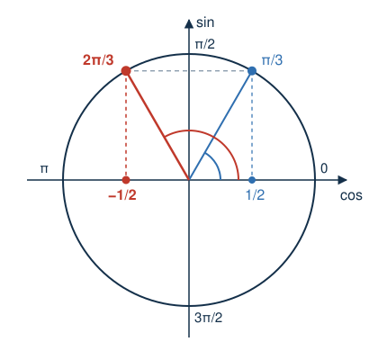

# Présentation {.divider background-color="#14304a"}

## Le déroulé de la séance

<table class="deroule">
<thead><tr><th>Temps</th><th>Durée</th><th>Ce qu'on y fait</th></tr></thead>
<tbody>
<tr><td class="ph">1 · Échauffement</td><td class="du">10 min</td><td>Quatre questions rapides projetées. Tu réponds sur papier, puis on vote.</td></tr>
<tr><td class="ph">2 · Socle</td><td class="du">35 min</td><td>Les exercices de base, à ton rythme, en t'auto-corrigeant sur un site.</td></tr>
<tr><td class="ph">3 · Pause</td><td class="du">10 min</td><td>On souffle, on prend un café, ...</td></tr>
<tr><td class="ph">4 · Transfert</td><td class="du">35 min</td><td>Des problèmes en contexte. Ici le travail avec les voisin·es est conseillé.</td></tr>
<tr><td class="ph">5 · Méthodes</td><td class="du">20 min</td><td>On dégage ensemble deux méthodes réutilisables.</td></tr>
</tbody>
</table>

## La gestion du bruit

::::::: modes
:::: {.mode .travail}
::: m-titre
Travail autonome
:::

Seul ou avec tes voisin·es : le bruit est normal, mais il doit rester **contenu**.
::::

:::: {.mode .jeparle}
::: m-titre
Travail collectif
:::

Quand je reprends la parole, j'ai besoin d'un **silence complet**.
::::
:::::::

Le **niveau sonore projeté** reste affiché pendant les moments de travail :

- **Bleu** — c'est bon, on continue.
- **Rouge**, signalé par **un gong** — on baisse le volume d'un cran.

::: {.aretenir .smaller}
**Seul·es tes voisin·es doivent t'entendre.** Avec environ 400 étudiant·es dans la salle, quelques conversations de trop suffisent à rendre le travail impossible pour tout le monde.
:::

# Annonces {.divider background-color="#14304a"}

## Annonces

Les prochaines remédiations seront annoncées via Moodle demain soir.

# Échauffement {.divider background-color="#14304a"}

## Les questions

::::::::::::::: columns
::::: {.column width="62%"}
:::: {style="font-size:.85em"}
**Q1** [[O1]{.obj}]{style="float:right"} — « Le triple d'un nombre, augmenté de $4$, vaut $19$. » Quelle équation traduit cette phrase ?

**Q2** [[O2]{.obj}]{style="float:right"} — le couple $(2,\, 1)$ est-il solution du système $\begin{cases} x + y = 3 \\ 2x - y = 4 \end{cases}$ ?

**Q3** [[O5]{.obj}]{style="float:right"} — combien de solutions l'équation $x^2 - 4x + 5 = 0$ admet-elle ?

**Q4** [[Séance 2 · O4]{.obj}]{style="float:right"} — que vaut $\cos\left(\dfrac{2\pi}{3}\right)$ ?
::::
:::::

::::::::::: {.column width="38%"}
::::: wooclap
:::: wc-body
**Vote sur Wooclap**

::: wc-lien
Code : HXHQLBN
:::
::::

::: {.wc-qr}

:::

:::::

::::::: et-timer
```{=html}
<style>
@keyframes et-pulse { 0%, 100% { opacity: 1; } 50% { opacity: .35; } }
</style>
```

:::::: {#et-timer-box data-default="300"}
:::: et-row
<button id="et-minus" class="et-btn" type="button" aria-label="Retirer une minute">

−1 min

</button>

::: {#et-display .et-display}
05:00
:::

<button id="et-plus" class="et-btn" type="button" aria-label="Ajouter une minute">

+1 min

</button>
::::

::: et-row
<button id="et-toggle" class="et-btn et-primary" type="button">

Démarrer

</button>

<button id="et-reset" class="et-btn" type="button" aria-label="Réinitialiser">

↺ Réinitialiser

</button>
:::
::::::
:::::::
:::::::::::
:::::::::::::::

```{=html}
<script>
(function () {
  var box = document.getElementById('et-timer-box');
  if (!box) return;
  var DEFAULT = parseInt(box.getAttribute('data-default'), 10) || 300;
  var display = document.getElementById('et-display');
  var btnToggle = document.getElementById('et-toggle');
  var btnMinus = document.getElementById('et-minus');
  var btnPlus = document.getElementById('et-plus');
  var btnReset = document.getElementById('et-reset');

  var remaining = DEFAULT;
  var running = false;
  var intervalId = null;
  var audioCtx = null;

  function fmt(s) {
    s = Math.max(0, s);
    var m = Math.floor(s / 60);
    var sec = s % 60;
    return (m < 10 ? '0' : '') + m + ':' + (sec < 10 ? '0' : '') + sec;
  }

  function render() {
    display.textContent = fmt(remaining);
    display.classList.toggle('et-warn', running && remaining <= 30 && remaining > 0);
    display.classList.toggle('et-done', remaining === 0);
  }

  function beep() {
    try {
      if (!audioCtx) audioCtx = new (window.AudioContext || window.webkitAudioContext)();
      var t0 = audioCtx.currentTime;
      [0, 0.35].forEach(function (offset) {
        var osc = audioCtx.createOscillator();
        var gain = audioCtx.createGain();
        osc.type = 'sine';
        osc.frequency.value = 880;
        gain.gain.setValueAtTime(0.0001, t0 + offset);
        gain.gain.exponentialRampToValueAtTime(0.3, t0 + offset + 0.02);
        gain.gain.exponentialRampToValueAtTime(0.0001, t0 + offset + 0.28);
        osc.connect(gain);
        gain.connect(audioCtx.destination);
        osc.start(t0 + offset);
        osc.stop(t0 + offset + 0.3);
      });
    } catch (e) {}
  }

  function stop() {
    running = false;
    btnToggle.textContent = remaining > 0 ? 'Reprendre' : 'Démarrer';
    if (intervalId) { clearInterval(intervalId); intervalId = null; }
  }

  function tick() {
    remaining -= 1;
    if (remaining <= 0) {
      remaining = 0;
      stop();
      beep();
    }
    render();
  }

  function start() {
    if (running) return;
    try {
      if (!audioCtx) audioCtx = new (window.AudioContext || window.webkitAudioContext)();
      if (audioCtx.state === 'suspended') audioCtx.resume();
    } catch (e) {}
    if (remaining <= 0) remaining = DEFAULT;
    render();
    running = true;
    btnToggle.textContent = 'Pause';
    intervalId = setInterval(tick, 1000);
  }

  btnToggle.addEventListener('click', function () { running ? stop() : start(); });
  btnMinus.addEventListener('click', function () {
    remaining = Math.max(0, remaining - 60);
    render();
    if (remaining === 0) stop();
  });
  btnPlus.addEventListener('click', function () {
    remaining = remaining + 60;
    render();
  });
  btnReset.addEventListener('click', function () {
    stop();
    remaining = DEFAULT;
    btnToggle.textContent = 'Démarrer';
    render();
  });

  render();
})();
</script>
```

## Q1 [[O1]{.obj}]{style="float:right"}

« Le triple d'un nombre, augmenté de $4$, vaut $19$. »

Quelle équation traduit cette phrase ?

. . .

::: aretenir
Soit $x$ le nombre. « Le triple » donne $3x$, « augmenté de $4$ » donne $3x + 4$ : l'équation est $3x + 4 = 19$, et $x = 5$.

Écrire $3(x + 4) = 19$ est l'erreur classique : l'**ordre des mots** fixe l'ordre des opérations.
:::

::: notes
Cette question amène la première méthode : mettre un problème en équation.
:::

## Q2 [[O2]{.obj}]{style="float:right"}

Le couple $(2,\, 1)$ est-il solution du système suivant ?

::: {.big-eq .center}
$\begin{cases} x + y = 3 \\ 2x - y = 4 \end{cases}$
:::

. . .

::: aretenir
**Non.** La première équation est vérifiée : $2 + 1 = 3$. La seconde ne l'est pas : $2 \cdot 2 - 1 = 3 \ne 4$.

Un couple est solution d'un système s'il vérifie **toutes** les équations. S'arrêter à la première est l'erreur classique.
:::

::: notes
Cette question amène la seconde méthode : résoudre un système linéaire.
:::

## Q3 [[O5]{.obj}]{style="float:right"}

Combien de solutions l'équation suivante admet-elle ?

::: {.big-eq .center}
$x^2 - 4x + 5 = 0$
:::

. . .

::: aretenir
$\Delta = (-4)^2 - 4 \cdot 1 \cdot 5 = 16 - 20 = -4 < 0$ : **aucune** solution réelle, $\mathrm{Sol} = \varnothing$.

C'est le **signe** de $\Delta$ qui donne le nombre de solutions : deux si $\Delta > 0$, une si $\Delta = 0$, aucune si $\Delta < 0$.
:::

## Q4 [[Séance 2 · O4]{.obj}]{style="float:right"}

Que vaut : $\cos\left(\dfrac{2\pi}{3}\right)$?


. . .

:::::: columns
::::: {.column width="60%"}
::: {.aretenir .smaller}
$\dfrac{2\pi}{3} = 120°$ est dans le **deuxième quadrant**, où le cosinus est **négatif**. C'est le symétrique de $\dfrac{\pi}{3}$ par rapport à l'axe vertical, donc $\cos\left(\dfrac{2\pi}{3}\right) = -\cos\left(\dfrac{\pi}{3}\right) = -\dfrac{1}{2}$.

Oublier le signe imposé par le quadrant, ou confondre avec $\sin\left(\dfrac{\pi}{3}\right) = \dfrac{\sqrt3}{2}$, sont les erreurs classiques.
:::
:::::

::::: {.column width="40%"}
{fig-alt="Cercle trigonométrique : les angles π/3 et 2π/3 sont symétriques par rapport à l'axe vertical ; leurs cosinus valent 1/2 et −1/2." width="100%"}
:::::
::::::

# Institutionnalisation {.divider background-color="#14304a"}

## Avant de commencer

Aujourd'hui, on construit une méthode pour **mettre un problème en équation**, le résoudre et contrôler la réponse.

Avec tes mots : quand tu lis un énoncé de problème, par quoi commences-tu ?

:::::: wooclap
::: wc-play
▶
:::

:::: wc-body
**Ouvre le Wooclap**

::: wc-lien
Code : ZQFAKOT
:::
::::

::: {.wc-qr}


Mettre en équation
:::

::::::

## Un exemple pour construire la méthode

Un flacon de sérum contient $500$ mL. Après $3$ heures de perfusion à **débit constant**, il reste $140$ mL dans le flacon.

Quel est le débit de la perfusion ?

On va construire la réponse, une étape à la fois.

## Étape 1 — l'inconnue

[1]{.step} **Que cherche-t-on, et dans quelle unité ?**

La question posée désigne l'inconnue.

. . .

::: aretenir
Soit $d$ le débit de la perfusion, en mL/h.

Nommer l'inconnue **et** son unité évite de mélanger ensuite des heures, des minutes, des mL et des L.
:::

## Étape 2 — traduire

[2]{.step} **Quelle égalité l'énoncé décrit-il ?**

On traduit morceau par morceau, dans l'ordre des mots.

. . .

::: aretenir
En $3$ heures, le flacon perd $3d$ mL. Il en reste $140$. Donc l'équation est $500 - 3d = 140$.

Les deux membres de l'équation sont en mL.
:::

## Étape 3 — résoudre

[3]{.step} **Quelles transformations appliquer aux deux membres ?**

. . .

::: aretenir
$$500 - 3d = 140 \;\Leftrightarrow\; -3d = -360 \;\Leftrightarrow\; d = 120.$$

On applique la **même** transformation aux deux membres, à chaque étape : $\mathrm{Sol} = \{120\}$.
:::

## Étape 4 — contrôler

[4]{.step} **La solution a-t-elle un sens dans le contexte ?**

. . .

::: aretenir
**Vérification** : $500 - 3 \cdot 120 = 500 - 360 = 140$. ✓

**Admissibilité** : un débit est positif, et il ne peut pas vider plus que le flacon en $3$ heures, donc $3d \le 500$. Avec $d = 120$, on a $360 \le 500$. ✓
:::

## Étape 5 — répondre

[5]{.step} **Qu'écrit-on comme réponse ?**

. . .

::: aretenir
La perfusion a un débit de $120$ mL/h.

On répond à la **question posée**, par une phrase, avec l'**unité**. Le nombre $120$ seul ne suffit pas.
:::

## Le piège à connaître

:::: piege
::: pg-titre
Piège
:::

Traduire l'énoncé dans le mauvais **ordre** ($3(x + 4)$ pour « le triple, augmenté de $4$ ») ; oublier l'**unité** de l'inconnue ; accepter une solution sans vérifier qu'elle a un **sens** dans le contexte.
::::

## La carte « Mettre un problème en équation » {.smaller}

C'est la page qui t'attend sur ta **feuille de méthode** — même squelette, tu la remplis en même temps.

:::::::::::::: fiche
::: fiche-head
Mettre un problème en équation [[O1]{.obj}]{style="float:right"}
:::

:::::::::::: fiche-body
:::::: fiche-col
::: {.fiche-field .empty}
Exercices associés (numéros)

*à noter toi-même*
:::

::: {.fiche-field .empty}
Théorie associée (chapitre / slide)

*à noter toi-même*
:::

::: {.fiche-field .fragment}
Quand l'utiliser ?

Dès qu'un énoncé décrit une situation par des mots et demande une valeur inconnue.
:::
::::::

::::::: fiche-col
:::: fiche-field
Étapes

::: incremental
1.  **Inconnue** : repère la question posée, nomme l'inconnue et son **unité**.
2.  **Traduire** : écris chaque relation, morceau par morceau, dans l'ordre des mots ; vérifie que les deux membres ont la même unité.
3.  **Résoudre** : applique la même transformation aux deux membres.
4.  **Contrôler** : vérifie la solution dans l'équation et son **admissibilité** (signe, domaine, ordre de grandeur).
5.  **Répondre** : une phrase, avec l'unité.
:::
::::

::: {.fiche-field .fragment}
Exemple

Flacon de $500$ mL, $140$ mL restants après $3$ h. Soit $d$ le débit (mL/h) : $500 - 3d = 140$, donc $d = 120$. Vérification : $500 - 360 = 140$ ✓. Le débit vaut $120$ mL/h.
:::

::: {.fiche-field .fragment}
Le piège

Traduire dans le mauvais ordre ; oublier l'unité ; accepter une solution sans vérifier qu'elle a un sens.
:::
:::::::
::::::::::::
::::::::::::::

::: footer-note
Cette fiche rejoint ta **boîte à outils** sur le site.
:::

# Méthode 2 : résoudre un système linéaire {.divider background-color="#1f5fbf"}

## Avant de commencer

Deux inconnues, deux équations : comment s'y prendre ?

Avec tes mots : comment ramener un système à une équation à **une seule** inconnue ?

:::::: wooclap
::: wc-play
▶
:::

:::: wc-body
**Ouvre le Wooclap**

::: wc-lien
Code : ZQFAKOT
:::
::::

::: {.wc-qr}


Systèmes
:::

::::::

## Notre fil rouge

Un laboratoire dispose de $30$ tubes de prélèvement, les uns de $5$ mL, les autres de $10$ mL. Remplis, ils contiennent $200$ mL au total.

Combien y a-t-il de tubes de chaque sorte ?

Comme pour la méthode précédente, on procède par morceaux.

## Étape 1 — poser le système

[1]{.step} **Quelles inconnues, et quelles équations ?**

Deux inconnues demandent **deux** équations.

. . .

::: aretenir
Soit $x$ le nombre de tubes de $5$ mL et $y$ le nombre de tubes de $10$ mL.

$$\begin{cases} x + y = 30 & (1) \quad \text{nombre de tubes} \\ 5x + 10y = 200 & (2) \quad \text{volume, en mL} \end{cases}$$
:::

## Étape 2 — se ramener à une inconnue

[2]{.step} **Substitution ou élimination ?**

. . .

::: aretenir
**Substitution** : dans $(1)$, le coefficient de $x$ vaut $1$, donc $x = 30 - y$. On remplace dans $(2)$ :
$$5(30 - y) + 10y = 200 \;\Leftrightarrow\; 150 + 5y = 200 \;\Leftrightarrow\; y = 10.$$

**Élimination** : on multiplie $(1)$ par $-5$, puis on additionne à $(2)$ terme à terme : $-5x - 5y + 5x + 10y = -150 + 200$, soit $5y = 50$. Même résultat.
:::

## Étape 3 — remonter et vérifier

[3]{.step} **Comment obtenir l'autre inconnue, et comment être sûr du couple ?**

. . .

::: aretenir
On reporte dans $x = 30 - y$ : $x = 20$. Donc $\mathrm{Sol} = \{(20,\, 10)\}$.

**Vérification** dans **les deux** équations : $20 + 10 = 30$ ✓ et $5 \cdot 20 + 10 \cdot 10 = 100 + 100 = 200$ ✓.

Il y a $20$ tubes de $5$ mL et $10$ tubes de $10$ mL.
:::

## Étape 4 — une seule solution, aucune, ou une infinité ?

[4]{.step} **Et si tous les tubes contenaient $5$ mL ?**

Le système devient $\begin{cases} x + y = 30 \\ 5x + 5y = 200 \end{cases}$.

. . .

::: aretenir
En retranchant $5$ fois $(1)$ de $(2)$, on obtient $0 = 50$ : égalité **toujours fausse**. **Aucune solution**, $\mathrm{Sol} = \varnothing$ : les droites sont **parallèles**. Trente tubes de $5$ mL ne font que $150$ mL.

Avec $5x + 5y = 150$, on obtiendrait $0 = 0$ : égalité **toujours vraie**, une **infinité** de solutions, droites **confondues**.
:::

## Le piège à connaître

:::: piege
::: pg-titre
Piège
:::

Donner un seul nombre au lieu d'un **couple** ; ne vérifier qu'**une** des deux équations ; en élimination, ne multiplier qu'un membre de l'équation ; lire « $0 = 0$ » comme « $x = 0$ ».
::::

## La carte « Résoudre un système linéaire » {.smaller}

:::::::::::::: fiche
::: fiche-head
Résoudre un système linéaire [[O2]{.obj}]{style="float:right"}
:::

:::::::::::: fiche-body
:::::: fiche-col
::: {.fiche-field .empty}
Exercices associés (numéros)

*à noter toi-même*
:::

::: {.fiche-field .empty}
Théorie associée (chapitre / slide)

*à noter toi-même*
:::

::: {.fiche-field .fragment}
Quand l'utiliser ?

Dès qu'il faut trouver **plusieurs** inconnues satisfaisant **plusieurs** équations en même temps.
:::
::::::

::::::: fiche-col
:::: fiche-field
Étapes

::: incremental
1.  **Poser** : une inconnue par grandeur (avec son unité), une équation par relation ; numérote-les.
2.  **Se ramener à une inconnue** : substitution (isoler, remplacer) ou élimination (coefficients opposés, addition terme à terme).
3.  **Remonter** : reporte la valeur trouvée pour obtenir l'autre inconnue ; vérifie le couple dans **les deux** équations.
4.  **Conclure** : une valeur par inconnue → une solution ; égalité toujours fausse → $\mathrm{Sol} = \varnothing$ ; égalité toujours vraie → une infinité.
:::
::::

::: {.fiche-field .fragment}
Exemple

$30$ tubes, de $5$ et $10$ mL, pour $200$ mL : $x + y = 30$ et $5x + 10y = 200$. Substitution : $x = 30 - y$, $150 + 5y = 200$, donc $y = 10$ et $x = 20$. $\mathrm{Sol} = \{(20,\, 10)\}$.
:::

::: {.fiche-field .fragment}
Le piège

Donner un seul nombre au lieu d'un couple ; ne vérifier qu'une équation ; lire « $0 = 0$ » comme « $x = 0$ ».
:::
:::::::
::::::::::::
::::::::::::::

::: footer-note
Cette fiche rejoint ta **boîte à outils** sur le site.
:::
