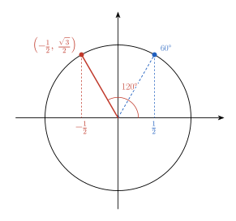
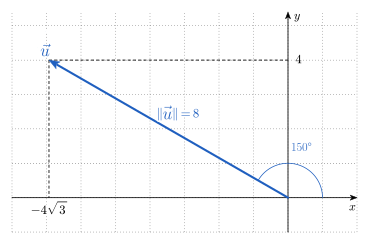
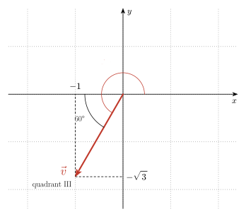
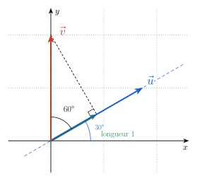

# Rappel {.divider background-color="#14304a"}

## Où trouver l'aide pendant la séance

[1]{.step} **Cherche d'abord seul·e** : bloquer fait partie de l'apprentissage.

[2]{.step} **Bloqué·e ?** Ouvre les **coups de pouce** du site, un à un et dans l'ordre : la référence théorique, la question à te poser, une étape, et seulement en dernier la solution.

[3]{.step} **Besoin d'une méthode type ?** La **boîte à outils** et les **fiches méthode** sont sur le site.

[4]{.step} **Toujours bloqué·e après les coups de pouce ?** Lève la main : quelqu'un passe t'aider.

::: aretenir
Le site est accessible tout le temps, en séance comme à la maison.
:::

::: notes
C'est normal de bloquer : ça fait partie de l'apprentissage. Quand ça t'arrive, cherche l'aide dans cet ordre : d'abord les coups de pouce du site, un à un, puis la boîte à outils et les fiches méthode, et si tu bloques encore, lève la main et quelqu'un viendra t'aider. Le site reste disponible tout le temps, en séance comme chez toi.
:::

# Annonces {.divider background-color="#14304a"}

## Annonces

Deux séances de remédiations, à distance, sous forme de questions-réponses:

1. Mardi: pour les biologistes. Posez vos questions pour aujourd'hui 13h via l'activité "Remédiation du 13/10" sur moodle.

2. Jeudi: pour les biologistes et les biomeds. Posez vos questions pour mercredi 14 au plus tard via l'activité "Remédiation du 15/10" sur moodle.

# Échauffement {.divider background-color="#14304a"}

## Les questions

::::::::::::::: columns
::::: {.column width="62%"}
:::: {style="font-size:.85em"}
**Q1** [[O3]{.obj}]{style="float:right"} — avec $A = (1, -1)$ et $B = (4, 3)$, quelles sont les coordonnées de $\overrightarrow{AB}$ ?

**Q2** [[O3]{.obj}]{style="float:right"} — que vaut la norme du vecteur $(-6, 8)$ ?

**Q3** [[O2]{.obj}]{style="float:right"} — que vaut le produit scalaire $(2, 1) \cdot (-1, 2)$ ? Que peut-on en conclure ?

**Q4** [[Séance 2 · O4]{.obj}]{style="float:right"} — quelles sont les coordonnées du point du cercle trigonométrique associé à $120°$ ?
::::
:::::

::::::::::: {.column width="38%"}
::::: wooclap
:::: wc-body
**Vote sur Wooclap**

::: wc-lien
Code : HSRYQMA
:::
::::

::: {.wc-qr}

:::


:::::

::::::: et-timer
```{=html}
<style>
@keyframes et-pulse { 0%, 100% { opacity: 1; } 50% { opacity: .35; } }
</style>
```

:::::: {#et-timer-box data-default="300"}
:::: et-row
<button id="et-minus" class="et-btn" type="button" aria-label="Retirer une minute">

−1 min

</button>

::: {#et-display .et-display}
05:00
:::

<button id="et-plus" class="et-btn" type="button" aria-label="Ajouter une minute">

+1 min

</button>
::::

::: et-row
<button id="et-toggle" class="et-btn et-primary" type="button">

Démarrer

</button>

<button id="et-reset" class="et-btn" type="button" aria-label="Réinitialiser">

↺ Réinitialiser

</button>
:::
::::::
:::::::
:::::::::::
:::::::::::::::

```{=html}
<script>
(function () {
  var box = document.getElementById('et-timer-box');
  if (!box) return;
  var DEFAULT = parseInt(box.getAttribute('data-default'), 10) || 300;
  var display = document.getElementById('et-display');
  var btnToggle = document.getElementById('et-toggle');
  var btnMinus = document.getElementById('et-minus');
  var btnPlus = document.getElementById('et-plus');
  var btnReset = document.getElementById('et-reset');

  var remaining = DEFAULT;
  var running = false;
  var intervalId = null;
  var audioCtx = null;

  function fmt(s) {
    s = Math.max(0, s);
    var m = Math.floor(s / 60);
    var sec = s % 60;
    return (m < 10 ? '0' : '') + m + ':' + (sec < 10 ? '0' : '') + sec;
  }

  function render() {
    display.textContent = fmt(remaining);
    display.classList.toggle('et-warn', running && remaining <= 30 && remaining > 0);
    display.classList.toggle('et-done', remaining === 0);
  }

  function beep() {
    try {
      if (!audioCtx) audioCtx = new (window.AudioContext || window.webkitAudioContext)();
      var t0 = audioCtx.currentTime;
      [0, 0.35].forEach(function (offset) {
        var osc = audioCtx.createOscillator();
        var gain = audioCtx.createGain();
        osc.type = 'sine';
        osc.frequency.value = 880;
        gain.gain.setValueAtTime(0.0001, t0 + offset);
        gain.gain.exponentialRampToValueAtTime(0.3, t0 + offset + 0.02);
        gain.gain.exponentialRampToValueAtTime(0.0001, t0 + offset + 0.28);
        osc.connect(gain);
        gain.connect(audioCtx.destination);
        osc.start(t0 + offset);
        osc.stop(t0 + offset + 0.3);
      });
    } catch (e) {}
  }

  function stop() {
    running = false;
    btnToggle.textContent = remaining > 0 ? 'Reprendre' : 'Démarrer';
    if (intervalId) { clearInterval(intervalId); intervalId = null; }
  }

  function tick() {
    remaining -= 1;
    if (remaining <= 0) {
      remaining = 0;
      stop();
      beep();
    }
    render();
  }

  function start() {
    if (running) return;
    try {
      if (!audioCtx) audioCtx = new (window.AudioContext || window.webkitAudioContext)();
      if (audioCtx.state === 'suspended') audioCtx.resume();
    } catch (e) {}
    if (remaining <= 0) remaining = DEFAULT;
    render();
    running = true;
    btnToggle.textContent = 'Pause';
    intervalId = setInterval(tick, 1000);
  }

  btnToggle.addEventListener('click', function () { running ? stop() : start(); });
  btnMinus.addEventListener('click', function () {
    remaining = Math.max(0, remaining - 60);
    render();
    if (remaining === 0) stop();
  });
  btnPlus.addEventListener('click', function () {
    remaining = remaining + 60;
    render();
  });
  btnReset.addEventListener('click', function () {
    stop();
    remaining = DEFAULT;
    btnToggle.textContent = 'Démarrer';
    render();
  });

  render();
})();
</script>
```

## Q1 [[O3]{.obj}]{style="float:right"}

Avec $A = (1, -1)$ et $B = (4, 3)$, quelles sont les coordonnées de $\overrightarrow{AB}$ ?

. . .

::: aretenir
On fait « extrémité moins origine » : $\overrightarrow{AB} = (4 - 1,\ 3 - (-1)) = (3, 4)$.


Calculer « origine moins extrémité » donne $(-3, -4) = \overrightarrow{BA}$ : même direction, **sens opposé**. C'est l'erreur classique.
:::

## Q2 [[O3]{.obj}]{style="float:right"}

Que vaut la norme du vecteur $(-6, 8)$ ?

. . .

::: aretenir
$\Vert (-6, 8)\Vert = \sqrt{(-6)^2 + 8^2} = \sqrt{36 + 64} = \sqrt{100} = 10$.

Une norme est **toujours positive** : le signe de $-6$ disparaît au carré. Additionner les coordonnées ($-6 + 8 = 2$) ou leurs valeurs absolues ($14$) sont les erreurs classiques.
:::

## Q3 [[O2]{.obj}]{style="float:right"}

Que vaut le produit scalaire $(2, 1) \cdot (-1, 2)$ ? Que peut-on en conclure ?

. . .

::: aretenir
$(2, 1) \cdot (-1, 2) = 2 \cdot (-1) + 1 \cdot 2 = 0$ : les deux vecteurs (non nuls) sont **orthogonaux**.

Un produit scalaire nul ne veut pas dire qu'un des vecteurs est nul.
:::

::: notes
Cette question amène la seconde méthode : calculer et interpréter un produit scalaire.
:::

## Q4 [[Séance 2 · O4]{.obj}]{style="float:right"}

Quelles sont les coordonnées du point du cercle trigonométrique associé à $120°$ ?

. . .

:::::: columns
::::: {.column width="58%"}
::: {.aretenir .smaller}
$120°$ est dans le **deuxième quadrant** : cosinus négatif, sinus positif. C'est le symétrique de $60°$ par rapport à l'axe vertical, donc
$$\left(\cos 120°,\ \sin 120°\right) = \left(-\frac12,\ \frac{\sqrt3}{2}\right).$$

Oublier le signe du cosinus, ou échanger cosinus et sinus, sont les erreurs classiques.
:::
:::::

::::: {.column width="42%"}
{fig-alt="Cercle trigonométrique : le point associé à 120° a pour coordonnées (−1/2, √3/2), symétrique du point associé à 60°." width="100%"}
:::::
::::::

::: notes
Cette question amène la première méthode : passer de la norme et de l'angle aux coordonnées.
:::

# Méthode 1 : de la norme et de l'angle aux coordonnées {.divider background-color="#1f5fbf"}

## Avant de commencer


Avec tes mots : comment obtiens-tu les coordonnées d'un vecteur dont tu connais la norme et l'angle avec l'horizontale ?

::::::: wooclap
::: wc-play
▶
:::

:::: wc-body
**Ouvre le Wooclap**

::: wc-lien
Code : À COMPLÉTER
:::
::::

::: {.wc-qr}


Norme et angle
:::

:::::::

## Notre fil rouge

On considère un vecteur $\vec u$ de norme $8$, qui fait un angle de $150°$ avec l'horizontale.

Quelles sont les coordonnées de $\vec u$ ?

On va construire la réponse, une étape à la fois.

## Étape 1 — dessiner

[1]{.step} **Dans quel quadrant se trouve $\vec u$ ?**

On dessine le vecteur à partir de l'origine du repère.

. . .

:::::: columns
::::: {.column width="45%"}
::: aretenir
$150°$ est entre $90°$ et $180°$ : $\vec u$ est dans le **deuxième quadrant**.

On attend donc $u_x < 0$ et $u_y > 0$.
:::
:::::
::::: {.column width="55%"}
{fig-alt="Vecteur F de norme 8 à 150 degrés, avec ses composantes −4√3 et 4." width="100%"}
:::::
::::::

## Étape 2 — la formule

[2]{.step} **D'où vient la formule des coordonnées ?**

Sur le cercle trigonométrique, le point d'angle $\theta$ est $(\cos\theta,\ \sin\theta)$ : c'est un vecteur de norme $1$.

. . .

::: aretenir
$\vec u$ a la même direction et le même sens, mais une norme $8$ fois plus grande : on multiplie par $8$.
$$\vec u = \left(\Vert \vec u\Vert \cos\theta,\ \Vert \vec u\Vert \sin\theta\right) = \left(8 \cos 150°,\ 8 \sin 150°\right).$$
:::

## Étape 3 — les valeurs remarquables

[3]{.step} **Que valent $\cos 150°$ et $\sin 150°$, sans calculatrice ?**

. . .

::: aretenir
$150° = 180° - 30°$ : c'est le symétrique de $30°$ par rapport à l'axe vertical. Donc
$$\cos 150° = -\cos 30° = -\frac{\sqrt3}{2} \quad\text{et}\quad \sin 150° = \sin 30° = \frac12.$$
Ainsi $\vec u = \left(8 \cdot \left(-\dfrac{\sqrt3}{2}\right),\ 8 \cdot \dfrac12\right) = \left(-4\sqrt3,\ 4\right)$.
:::

## Étape 4 — contrôler

[4]{.step} **Comment s'assurer du résultat ?**

. . .

::: aretenir
**Signes** : $-4\sqrt3 < 0$ et $4 > 0$, c'est bien le deuxième quadrant. ✓

**Norme** : $\sqrt{\left(-4\sqrt3\right)^2 + 4^2} = \sqrt{48 + 16} = \sqrt{64} = 8$. ✓
:::

## Et dans l'autre sens ?

Partons de $\vec v = \left(-1,\ -\sqrt3\right)$.

Quelle est la norme de ce vecteur, et quel angle fait-il avec l'horizontale ?

## Étapes 1 et 2 — norme et quadrant

[1]{.step} **Quelle est la norme ?** [2]{.step} **Dans quel quadrant est $\vec v$ ?**

. . .

:::::: columns
::::: {.column width="48%"}
::: aretenir
**Norme** : $\Vert \vec v\Vert = \sqrt{(-1)^2 + \left(-\sqrt3\right)^2} = \sqrt{1 + 3} = 2$.

**Quadrant** : $v_x < 0$ et $v_y < 0$, **troisième quadrant** : l'angle est entre $180°$ et $270°$.
:::
:::::
::::: {.column width="52%"}
{fig-alt="Vecteur v = (−1, −√3) dans le troisième quadrant, angle de 240 degrés." width="100%"}
:::::
::::::

## Étapes 3 et 4 — l'angle

[3]{.step} **Que donne la tangente ?** [4]{.step} **Quel est l'angle dans le bon quadrant ?**

. . .

::: aretenir
$\tan\theta = \dfrac{v_y}{v_x} = \dfrac{-\sqrt3}{-1} = \sqrt3$. L'angle aigu dont la tangente vaut $\sqrt3$ est $60°$.

Dans le troisième quadrant : $\theta = 180° + 60° = 240°$.

**Contrôle** : $2\left(\cos 240°,\ \sin 240°\right) = 2\left(-\dfrac12,\ -\dfrac{\sqrt3}{2}\right) = \left(-1,\ -\sqrt3\right)$. ✓
:::

## Le piège à connaître

:::: piege
::: pg-titre
Piège
:::

Oublier le **signe** imposé par le quadrant ; conclure $\theta = 60°$ avec la seule tangente, alors que $(1, \sqrt3)$ et $(-1, -\sqrt3)$ ont la même tangente ; échanger $\cos$ et $\sin$ en mesurant l'angle depuis l'axe des $y$.
::::

## La carte « Norme et angle ↔ coordonnées » {.smaller}

C'est la page qui t'attend sur ta **feuille de méthode** — même squelette, tu la remplis en même temps.

:::::::::::::: fiche
::: fiche-head
Passer de la norme et de l'angle aux coordonnées (et réciproquement) [[O3]{.obj}]{style="float:right"}
:::

:::::::::::: fiche-body
:::::: fiche-col
::: {.fiche-field .empty}
Exercices associés (numéros)

*à noter toi-même*
:::

::: {.fiche-field .empty}
Théorie associée (chapitre / slide)

*à noter toi-même*
:::

::: {.fiche-field .fragment}
Quand l'utiliser ?

Une grandeur orientée est donnée par sa norme et un angle, ou il faut retrouver norme et angle à partir des coordonnées.
:::
::::::

::::::: fiche-col
:::: fiche-field
Étapes

::: incremental
1.  **Dessiner** le vecteur et repérer le **quadrant**.
2.  **Vers les coordonnées** : $\vec v = \left(\Vert \vec v\Vert \cos\theta,\ \Vert \vec v\Vert \sin\theta\right)$, avec les valeurs remarquables.
3.  **Vers la norme et l'angle** : $\Vert \vec v\Vert = \sqrt{v_x^2 + v_y^2}$, puis $\tan\theta = \dfrac{v_y}{v_x}$ et le quadrant.
4.  **Contrôler** : signes des coordonnées et quadrant concordent.
:::
::::

::: {.fiche-field .fragment}
Exemple

Reprendre l'exemple des slides précédentes
:::

::: {.fiche-field .fragment}
Le piège

Oublier le signe imposé par le quadrant ; conclure avec la seule tangente ; échanger $\cos$ et $\sin$.
:::
:::::::
::::::::::::
::::::::::::::

::: footer-note
Cette fiche rejoint ta **boîte à outils** sur le site.
:::

# Méthode 2 : calculer et interpréter un produit scalaire {.divider background-color="#1f5fbf"}

## Avant de commencer

Le produit scalaire est un **nombre** : que dit-il des deux vecteurs ?

Avec tes mots : que t'apprend le **signe** de $\vec u \cdot \vec v$ ?

::::::: wooclap
::: wc-play
▶
:::

:::: wc-body
**Ouvre le Wooclap**

::: wc-lien
Code : ZSBTHOJ
:::
::::

::: {.wc-qr}


Produit scalaire
:::

:::::::

## Notre fil rouge

Soient $\vec u = \left(\sqrt3,\ 1\right)$ et $\vec v = (0, 2)$.

Quel angle font-ils ? Quelle est la longueur de la projection de $\vec v$ sur la droite qui porte $\vec u$ ?

On procède par étapes, comme pour la première méthode.

## Étape 1 — prévoir le signe

[1]{.step} **Sur un dessin, l'angle entre $\vec u$ et $\vec v$ est-il aigu, droit ou obtus ?**

. . .

:::::: columns
::::: {.column width="50%"}
::: aretenir
$\vec u$ fait $30°$ avec l'axe des $x$ ($\tan\theta = \frac{1}{\sqrt3}$, premier quadrant) et $\vec v$ pointe vers le haut.

L'angle est **aigu** : on attend $\vec u \cdot \vec v > 0$.
:::
:::::
::::: {.column width="50%"}
{fig-alt="Vecteurs u à 30 degrés et v vertical ; angle de 60 degrés ; la projection de v sur la droite de u mesure 1." width="90%"}
:::::
::::::

## Étape 2 — calculer

[2]{.step} **Que vaut $\vec u \cdot \vec v$ en utilisant les coordonnées des vecteurs ?**

. . .

::: aretenir
$$\vec u \cdot \vec v = u_x v_x + u_y v_y = \sqrt3 \cdot 0 + 1 \cdot 2 = 2.$$

Le résultat est positif, comme prévu. ✓
:::

## Étape 3 — l'angle

[3]{.step} **Comment passer du produit scalaire à l'angle ?**

. . .

::: aretenir
On égale les deux écritures : $\vec u \cdot \vec v = \Vert \vec u\Vert \Vert \vec v\Vert \cos\theta$.

$\Vert \vec u\Vert = \sqrt{3 + 1} = 2$ et $\Vert \vec v\Vert = 2$, donc
$$\cos\theta = \frac{\vec u \cdot \vec v}{\Vert \vec u\Vert \Vert \vec v\Vert} = \frac{2}{2 \cdot 2} = \frac12 \quad\Longrightarrow\quad \theta = 60°.$$

**Contrôle** sur le dessin : $90° - 30° = 60°$. ✓
:::

## Étape 4 — la projection

[4]{.step} **Que représente $\Vert \vec v\Vert \cos\theta$ sur le dessin ?**

. . .

:::::: columns
::::: {.column width="55%"}
::: aretenir
C'est la longueur (signée) de la **projection orthogonale** de $\vec v$ sur la droite qui porte $\vec u$ :
$$\Vert \vec v\Vert \cos\theta = \frac{\vec u \cdot \vec v}{\Vert \vec u\Vert} = \frac22 = 1.$$

Le produit scalaire vaut donc $\Vert \vec u\Vert \cdot$ (longueur de l'« ombre » de $\vec v$) $= 2 \cdot 1$.
:::
:::::
::::: {.column width="45%"}
{fig-alt="La projection de v sur la droite de u mesure 1." width="100%"}
:::::
::::::

## Étape 5 — l'orthogonalité

[5]{.step} **Pour quelle valeur de $a$ le vecteur $(a, 3)$ est-il orthogonal à $\vec u$ ?**

. . .

::: aretenir
Deux vecteurs non nuls sont orthogonaux si et seulement si leur produit scalaire est nul :
$$\left(\sqrt3,\ 1\right) \cdot (a, 3) = \sqrt3\,a + 3 = 0 \quad\Longleftrightarrow\quad a = -\frac{3}{\sqrt3} = -\sqrt3.$$

**Contrôle** : $\left(\sqrt3,\ 1\right) \cdot \left(-\sqrt3,\ 3\right) = -3 + 3 = 0$. ✓
:::

## Le piège à connaître

:::: piege
::: pg-titre
Piège
:::

Oublier de diviser par le **produit des normes** (un cosinus reste entre $-1$ et $1$) ; croire qu'un produit scalaire nul impose un vecteur nul ; prendre la projection dans une direction quelconque au lieu de la direction **perpendiculaire** à la droite de $\vec u$.
::::

## La carte « Produit scalaire » {.smaller}

:::::::::::::: fiche
::: fiche-head
Produit scalaire : angle, orthogonalité, projection [[O2]{.obj}]{style="float:right"}
:::

:::::::::::: fiche-body
:::::: fiche-col
::: {.fiche-field .empty}
Exercices associés (numéros)

*à noter toi-même*
:::

::: {.fiche-field .empty}
Théorie associée (chapitre / slide)

*à noter toi-même*
:::

::: {.fiche-field .fragment}
Quand l'utiliser ?

Dès qu'il faut un angle entre deux vecteurs non nuls, tester une perpendicularité, projeter un vecteur sur une direction, ou calculer un travail.
:::
::::::

::::::: fiche-col
:::: fiche-field
Étapes

::: incremental
1.  **Calculer** : $\vec u \cdot \vec v = u_x v_x + u_y v_y$.
2.  **Signe** : positif si l'angle est aigu, nul si les vecteurs sont orthogonaux, négatif s'il est obtus.
3.  **Angle** : $\cos\theta = \dfrac{\vec u \cdot \vec v}{\Vert \vec u\Vert \Vert \vec v\Vert}$.
4.  **Projection** : $\dfrac{\vec u \cdot \vec v}{\Vert \vec u\Vert}$ est la longueur signée de la projection de $\vec v$ sur la droite de $\vec u$.
:::
::::

::: {.fiche-field .fragment}
Exemple

Reprendre ce qui a été fait dans les slides précédentes.
:::

::: {.fiche-field .fragment}
Le piège

Oublier de diviser par le produit des normes ; croire qu'un produit scalaire nul impose un vecteur nul.
:::
:::::::
::::::::::::
::::::::::::::

::: footer-note
Cette fiche rejoint ta **boîte à outils** sur le site.
:::
